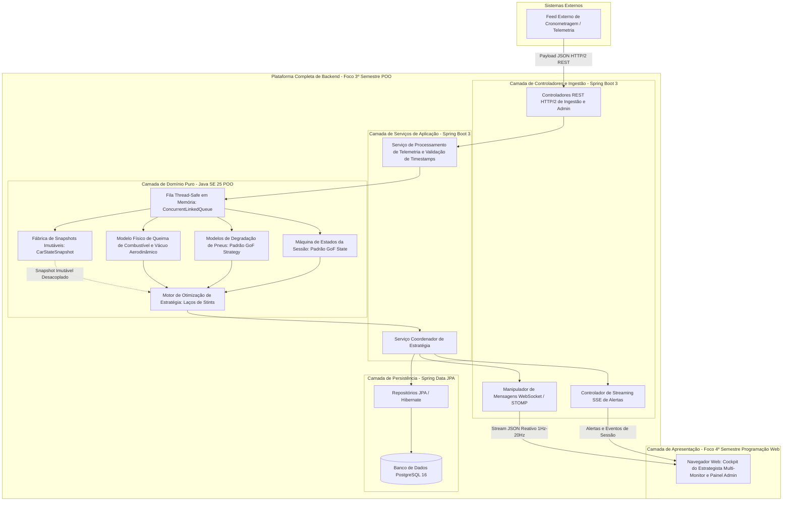
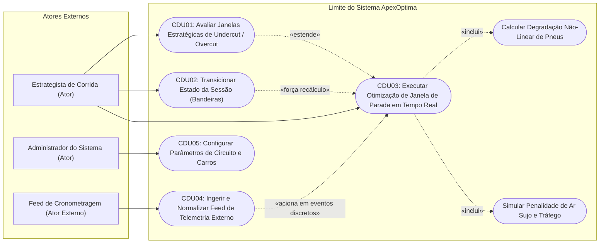

# Documento de Especificação de Requisitos de Software (DER)
## ApexOptima: Motor de Telemetria e Estratégia de Motorsport em Tempo Real

---

**Identificador do Documento:** DER-AO-2026-V1.0  
**Projeto:** ApexOptima — Motor de Telemetria e Estratégia de Motorsport em Tempo Real  
**Autor e Arquiteto de Sistemas:** Henry Maia Fagundes  
**Cargo:** Engenheiro de Software Líder e Arquiteto de Sistemas  
**Data da Versão Baseline:** 24 de agosto de 2026  
**Status:** Aprovado / Especificação Baseline de Produção  
**Conformidade Normativa:** IEEE Std 830-1998 e ISO/IEC/IEEE 29148:2018  

---

### Histórico de Revisões do Documento

| Versão | Data | Autor | Descrição das Modificações |
| :--- | :--- | :--- | :--- |
| **1.0** | 24 de agosto de 2026 | Henry Maia Fagundes | Versão baseline inicial estabelecendo a estrutura IEEE Std 830-1998, Arquitetura em Camadas Orientada a Objetos, roadmap acadêmico de dois semestres (3º Semestre: Backend e Persistência em POO; 4º Semestre: Frontend Cockpit em Programação Web), física matemática de domínio, padrões de projeto GoF e matrizes formais de rastreabilidade e verificação. |

---

## Sumário

1. [Introdução](#1-introdução)
   - 1.1 [Finalidade](#11-finalidade)
   - 1.2 [Convenções do Documento](#12-convenções-do-documento)
   - 1.3 [Público-Alvo e Sugestões de Leitura](#13-público-alvo-e-sugestões-de-leitura)
   - 1.4 [Escopo do Produto](#14-escopo-do-produto)
   - 1.5 [Definições, Acrônimos e Abreviações](#15-definições-acrônimos-e-abreviações)
   - 1.6 [Referências Normativas e Técnicas](#16-referências-normativas-e-técnicas)
   - 1.7 [Visão Geral do Documento](#17-visão-geral-do-documento)
2. [Descrição Geral](#2-descrição-geral)
   - 2.1 [Perspectiva do Produto](#21-perspectiva-do-produto)
     - 2.1.1 [Contexto do Sistema e Arquitetura em Camadas](#211-contexto-do-sistema-e-arquitetura-em-camadas)
     - 2.1.2 [Roadmap Acadêmico e Técnico de Dois Semestres](#212-roadmap-acadêmico-e-técnico-de-dois-semestres)
   - 2.2 [Funções do Produto (Resumo Executivo)](#22-funções-do-produto-resumo-executivo)
   - 2.3 [Classes e Características dos Usuários](#23-classes-e-características-dos-usuários)
   - 2.4 [Ambiente Operacional](#24-ambiente-operacional)
   - 2.5 [Restrições de Projeto e Implementação](#25-restrições-de-projeto-e-implementação)
   - 2.6 [Documentação de Usuário](#26-documentação-de-usuário)
   - 2.7 [Premissas e Dependências](#27-premissas-e-dependências)
   - 2.8 [Requisitos Diferidos e Escopo Futuro](#28-requisitos-diferidos-e-escopo-futuro)
3. [Requisitos Específicos](#3-requisitos-específicos)
   - 3.1 [Requisitos de Interfaces Externas](#31-requisitos-de-interfaces-externas)
     - 3.1.1 [Interfaces de Usuário](#311-interfaces-de-usuário)
     - 3.1.2 [Interfaces de Hardware](#312-interfaces-de-hardware)
     - 3.1.3 [Interfaces de Software](#313-interfaces-de-software)
     - 3.1.4 [Interfaces de Comunicação](#314-interfaces-de-comunicação)
   - 3.2 [Requisitos Funcionais (RF)](#32-requisitos-funcionais-rf)
     - 3.2.1 [Ingestão e Pré-processamento de Telemetria (RF-TEL)](#321-ingestão-e-pré-processamento-de-telemetria-rf-tel)
     - 3.2.2 [Física de Domínio e Simulação (RF-SIM)](#322-física-de-domínio-e-simulação-rf-sim)
     - 3.2.3 [Otimização de Estratégia de Paradas (RF-OPT)](#323-otimização-de-estratégia-de-paradas-rf-opt)
     - 3.2.4 [Gerenciamento de Estados da Sessão (RF-STA)](#324-gerenciamento-de-estados-da-sessão-rf-sta)
     - 3.2.5 [Notificações e Streaming em Tempo Real (RF-NOT)](#325-notificações-e-streaming-em-tempo-real-rf-not)
     - 3.2.6 [Administração e Calibração do Sistema (RF-ADM)](#326-administração-e-calibração-do-sistema-rf-adm)
   - 3.3 [Requisitos Não-Funcionais (RNF)](#33-requisitos-não-funcionais-rnf)
     - 3.3.1 [Requisitos de Desempenho (RNF-PERF)](#331-requisitos-de-desempenho-rnf-perf)
     - 3.3.2 [Qualidade Arquitetural e Estrutura POO (RNF-ARCH)](#332-qualidade-arquitetural-e-estrutura-poo-rnf-arch)
     - 3.3.3 [Fidelidade de Comunicação e Streaming (RNF-COMM)](#333-fidelidade-de-comunicação-e-streaming-rnf-comm)
     - 3.3.4 [Precisão Numérica e Integridade Computacional (RNF-PREC)](#334-precisão-numérica-e-integridade-computacional-rnf-prec)
     - 3.3.5 [Confiabilidade e Tolerância a Falhas (RNF-RELI)](#335-confiabilidade-e-tolerância-a-falhas-rnf-reli)
     - 3.3.6 [Segurança e Controle de Acesso (RNF-SEC)](#336-segurança-e-controle-de-acesso-rnf-sec)
   - 3.4 [Arquitetura em Camadas e Mandatos de Projeto POO](#34-arquitetura-em-camadas-e-mandatos-de-projeto-poo)
4. [Modelagem Profunda de Domínio e Regras de Negócio](#4-modelagem-profunda-de-domínio-e-regras-de-negócio)
   - 4.1 [Casos de Uso do Sistema](#41-casos-de-uso-do-sistema)
     - 4.1.1 [Diagrama de Casos de Uso](#411-diagrama-de-casos-de-uso)
     - 4.1.2 [CDU01: Avaliar Janelas Estratégicas de Undercut / Overcut](#412-cdu01-avaliar-janelas-estratégicas-de-undercut--overcut)
     - 4.1.3 [CDU02: Transicionar Estado da Sessão (Bandeira Verde / Safety Car)](#413-cdu02-transicionar-estado-da-sessão-bandeira-verde--safety-car)
     - 4.1.4 [CDU03: Executar Otimização de Janela de Parada em Tempo Real](#414-cdu03-executar-otimização-de-janela-de-parada-em-tempo-real)
     - 4.1.5 [CDU04: Ingerir e Normalizar Feed de Telemetria Externo](#415-cdu04-ingerir-e-normalizar-feed-de-telemetria-externo)
     - 4.1.6 [CDU05: Configurar Parâmetros de Circuito e Dinâmica de Veículos](#416-cdu05-configurar-parâmetros-de-circuito-e-dinâmica-de-veículos)
   - 4.2 [Regras de Negócio Matemáticas (RN)](#42-regras-de-negócio-matemáticas-rn)
     - 4.2.1 [Categoria A: Conformidade com Regulamentos Esportivos](#421-categoria-a-conformidade-com-regulamentos-esportivos)
     - 4.2.2 [Categoria B: Física, Otimização Estratégica e Lógica de Domínio](#422-categoria-b-física-otimização-estratégica-e-lógica-de-domínio)
     - 4.2.3 [Categoria C: Validação de Telemetria e Sincronização de Estados](#423-categoria-c-validação-de-telemetria-e-sincronização-de-estados)
5. [Matriz de Rastreabilidade e Metodologias de Verificação](#5-matriz-de-rastreabilidade-e-metodologias-de-verificação)
   - 5.1 [Matriz de Rastreabilidade de Requisitos (RTM)](#51-matriz-de-rastreabilidade-de-requisitos-rtm)
   - 5.2 [Metodologias de Verificação e Testes](#52-metodologias-de-verificação-e-testes)
6. [Aprovação e Assinatura do Documento](#6-aprovação-e-assinatura-do-documento)

---

## 1. Introdução

### 1.1 Finalidade
Este Documento de Especificação de Requisitos de Software (DER) provê uma descrição completa, rigorosa e inequívoca dos requisitos funcionais, não-funcionais, limites arquiteturais, modelos matemáticos e comportamentos operacionais do sistema **ApexOptima: Motor de Telemetria e Estratégia de Motorsport em Tempo Real**.

O ApexOptima foi concebido e estruturado como um projeto de engenharia de software avançado distribuído estrategicamente em dois semestres acadêmicos:
- **3º Semestre (Disciplina de Programação Orientada a Objetos):** Desenvolvimento completo da plataforma de backend, núcleo de domínio em Java SE 25 puro orientado a objetos, algoritmos de simulação física, camada de serviços em Spring Boot 3, persistência relacional com PostgreSQL 16+ via JPA/Hibernate e infraestrutura de mensageria via WebSockets.
- **4º Semestre (Disciplina de Programação Web):** Desenvolvimento da aplicação web interativa, cockpit multi-monitor do Estrategista de Corrida, streaming reativo no cliente e visualizações avançadas de dados de telemetria.

Este documento serve como contrato técnico formal de requisitos, aderindo rigorosamente ao padrão **IEEE Std 830-1998**.

### 1.2 Convenções do Documento
Este documento adota as seguintes convenções de nomenclatura e estilo:
- **Categorização e Identificação de Itens:**
  - `RF-XXX-YY`: Requisito Funcional, onde `XXX` denota o subsistema funcional e `YY` o identificador numérico sequencial.
  - `RNF-XXX-YY`: Requisito Não-Funcional, categorizado por atributos de qualidade de software (`PERF`, `ARCH`, `COMM`, `PREC`, `RELI`, `SEC`).
  - `RN-CAT-YY`: Regra de Negócio, dividida em Regulamentos Esportivos (`RN-ESP-YY`), Física e Lógica Estratégica (`RN-EST-YY`) e Validação de Telemetria (`RN-TEL-YY`).
  - `CDU-YY`: Caso de Uso formal.
- **Modalidade e Grau de Exigência (RFC 2119 / IEEE 830):**
  - **DEVE / OBRIGATÓRIO:** Capacidade essencial e mandatória.
  - **RECOMENDA-SE:** Melhoria técnica de alta prioridade.
  - **PODE:** Comportamento operacional opcional ou configurável.
- **Notação Matemática:** Fórmulas físicas, equações de desgaste não-linear e matrizes de otimização são expressas em notação formal LaTeX.
- **Precisão e Unidades:** Tempo em segundos ($s$) e milissegundos inteiros ($ms$), massa de combustível em quilogramas ($kg$), volume em litros ($L$) e velocidade em quilômetros por hora ($km/h$) ou metros por segundo ($m/s$).

### 1.3 Público-Alvo e Sugestões de Leitura
Este documento é direcionado aos seguintes perfis de leitores:
- **Avaliadores Acadêmicos e Professores:** Consultar a [Seção 2.1](#21-perspectiva-do-produto), [Seção 3.4](#34-arquitetura-em-camadas-e-mandatos-de-projeto-poo) e a [Seção 4](#4-modelagem-profunda-de-domínio-e-regras-de-negócio) para avaliar o rigor da modelagem Orientada a Objetos, o uso dos padrões GoF (Strategy e State), o isolamento de camadas e o encapsulamento de domínio.
- **Estrategistas de Corrida e Analistas de Simulação:** Consultar a [Seção 4.2](#42-regras-de-negócio-matemáticas-rn) para verificação das equações físicas de degradação térmica de pneus, cálculo de ar sujo e restrições de combustível de Parque Fechado.
- **Desenvolvedores Backend e Web:** Consultar a [Seção 3.1](#31-requisitos-de-interfaces-externas), [Seção 3.2](#32-requisitos-funcionais-rf) e [Seção 3.3](#33-requisitos-não-funcionais-rnf) para contratos de APIs, modelo de memória com zero alocação em hot-paths e protocolos WebSocket/SSE.
- **Equipes de Testes e Garantia de Qualidade:** Consultar a [Seção 5](#5-matriz-de-rastreabilidade-e-metodologias-de-verificação) para a matriz de rastreabilidade e métodos formais de verificação automatizada.

### 1.4 Escopo do Produto
O ApexOptima é um motor de estratégia para automobilismo projetado para ingerir fluxos de telemetria de um grid de 20 carros (em frequências de 1Hz a 20Hz) e produzir recomendações táticas de pit stop em tempo real com latência inferior a 100ms.

O escopo do sistema contempla:
1. **Plataforma Completa de Backend e Motor de Simulação (3º Semestre — Disciplina de POO):**
   - **Núcleo de Domínio em Java SE 25 Puro:** Entidades de domínio (`Car`, `Driver`, `Lap`, `Session`, `Circuit`), snapshots imutáveis (`CarStateSnapshot`) e padrões GoF (**Strategy Pattern** para modelagem de compostos de pneus, **State Pattern** para transições de bandeiras de corrida).
   - **Algoritmos Físicos e Estratégicos:** Modelagem de queima de combustível e redução de massa, penalidade aerodinâmica de turbulência ("ar sujo"), curvas quadráticas de desgaste de pneus com step de queda abrupta (*cliff*) e laços de otimização de stints.
   - **Backend Empresarial em Spring Boot 3:** Camada de serviços com injeção de dependência e controladores REST para ingestão de telemetria e gestão de sessões.
   - **Persistência Relacional (PostgreSQL e Spring Data JPA):** Esquema relacional e mapeamento Hibernate para armazenamento persistente de circuitos, histórico de voltas, tempos de setor e logs de telemetria.
   - **Infraestrutura de Mensageria em Tempo Real:** Servidor WebSocket (STOMP sobre RFC 6455) e despachadores Server-Sent Events (SSE).
   - **Testes Automatizados:** Testes unitários com JUnit 5 para o domínio físico e testes de integração Spring Boot para controladores e repositórios.
2. **Aplicação Web Interativa e Cockpit do Estrategista (4º Semestre — Disciplina de Programação Web):**
   - **Cockpit do Estrategista:** Single-Page Application (SPA) responsiva otimizada para múltiplos monitores no ambiente de pit-wall.
   - **Streaming Reativo no Cliente:** Ingestão cliente de WebSockets (STOMP) e SSE com reconexão automática, backoff exponencial e cache reativo de estado.
   - **Visualizações de Dados e Controles:** Gráficos dinâmicos de gap em relação ao líder, curvas de degradação com alarmes de *cliff*, projeções de janelas de *undercut/overcut* e formulários para intervenção manual em bandeiras e calibração de circuitos.
   - **Avaliação e Testes de Aceitação:** Simulações ponta a ponta com reprodução de dados históricos de GPs.

**Fora do Escopo Inicial:**
- Decodificação direta de sinais seriais CAN-bus de ECU de pista (a ingestão ocorre exclusivamente via endpoints HTTP/2 REST JSON normalizados).
- Renderização visual 3D WebGL de telemetria espacial dos veículos na pista.
- Integração dinâmica direta com satélites de radar meteorológico (parâmetros de pista molhada são injetados pela telemetria ou configurados pelo administrador).

### 1.5 Definições, Acrônimos e Abreviações

| Acrônimo / Termo | Definição |
| :--- | :--- |
| **Ar Sujo (Wake / Dirty Air)** | Turbulência aerodinâmica gerada por um carro à frente, resultando em perda de sustentação (downforce) e superaquecimento de pneus no carro seguidor. |
| **CDU / UC** | Caso de Uso (*Caso de Uso* / *Use Case*). |
| **DDD** | *Domain-Driven Design* — abordagem de design de software focada na lógica e regras do domínio. |
| **DER** | Documento de Especificação de Requisitos. |
| **DRS** | *Drag Reduction System* — sistema de redução de arrasto para facilitar ultrapassagens em zonas autorizadas quando a distância é $\le 1.0\text{s}$. |
| **DTI** | *Delta Time Interval* — intervalo diferencial de tempo entre dois veículos na pista. |
| **FIA** | *Fédération Internationale de l'Automobile* — órgão regulador do automobilismo mundial. |
| **JPA** | *Java Persistence API* / Padrão Jakarta Persistence. |
| **LTV** | *Lap Time Variance* — variância matemática entre o tempo real da volta e o tempo ideal ótimo. |
| **Overcut** | Estratégia na qual o piloto permanece mais tempo na pista antes de parar, utilizando ar limpo para abrir vantagem sobre o adversário que já parou. |
| **Parque Fechado (Parc Fermé)** | Condição regulatória que exige a retenção de uma quantidade mínima de combustível no tanque ao término da corrida para amostragem e inspeção da FIA. |
| **POO / OOP** | Programação Orientada a Objetos (*Object-Oriented Programming*). |
| **RBAC** | *Role-Based Access Control* — controle de acesso baseado em papéis de usuário. |
| **RF** | Requisito Funcional. |
| **RN** | Regra de Negócio. |
| **RNF** | Requisito Não-Funcional. |
| **RTM** | Matriz de Rastreabilidade de Requisitos (*Requirements Traceability Matrix*). |
| **SC** | *Safety Car* — veículo de segurança físico que neutraliza a velocidade em todos os setores da pista. |
| **SPA** | *Single-Page Application* — aplicação web rica executada dinamicamente no navegador do cliente. |
| **SRS** | *Software Requirements Specification* (equivalente em inglês a DER). |
| **SSE** | *Server-Sent Events* — padrão de comunicação unidirecional do servidor para o cliente via HTTP. |
| **STOMP** | *Simple Text Oriented Messaging Protocol* — sub-protocolo de mensagens sobre WebSocket. |
| **Undercut** | Estratégia na qual o piloto perseguidor para antes do rival para usar pneus novos e superá-lo quando este realizar seu pit stop. |
| **VSC** | *Virtual Safety Car* — procedimento de segurança que impõe tempo delta obrigatório em todos os setores sem uso de carro físico. |

### 1.6 Referências Normativas e Técnicas
1. **IEEE Std 830-1998:** *IEEE Recommended Practice for Software Requirements Specifications*, IEEE Computer Society, 1998.
2. **ISO/IEC/IEEE 29148:2018:** *Systems and software engineering — Life cycle processes — Requirements engineering*, ISO/IEEE, 2018.
3. **Regulamento Esportivo de Fórmula 1 da FIA (Edição 2026):** *Artigos 28 (Alocação e Uso de Pneus), 39 (Procedimentos de Safety Car), 40 (Procedimentos de Virtual Safety Car) e 54 (Amostragem de Combustível em Parque Fechado)*, FIA.
4. **Gamma, E., Helm, R., Johnson, R., & Vlissides, J. (1994):** *Padrões de Projeto: Soluções Reutilizáveis de Software Orientado a Objetos (GoF)*, Bookman.
5. **Martin, R. C. (2017):** *Arquitetura Limpa: O Guia do Artesão para Estrutura e Design de Software*, Alta Books.
6. **Evans, E. (2003):** *Domain-Driven Design: Atacando as Complexidades no Coração do Software*, Alta Books.
7. **RFC 6455:** *The WebSocket Protocol*, Internet Engineering Task Force (IETF), 2011.

### 1.7 Visão Geral do Documento
O restante desta especificação é estruturado da seguinte forma:
- **Seção 2 (Descrição Geral):** Contexto do sistema, arquitetura em camadas, papéis de usuários, ambiente operacional, restrições de memória/hot-path e roadmap acadêmico.
- **Seção 3 (Requisitos Específicos):** Interfaces externas, requisitos funcionais (`RF`) detalhados e requisitos não-funcionais (`RNF`).
- **Seção 4 (Modelagem Profunda de Domínio e Regras de Negócio):** Especificação completa dos Casos de Uso (`CDU`) com diagrama Mermaid e formulação matemática rigorosa das Regras de Negócio (`RN`).
- **Seção 5 (Matriz de Rastreabilidade e Verificação):** Matriz RTM e metodologias de garantia de qualidade.
- **Seção 6 (Aprovação):** Registro formal de assinatura técnica.

---

## 2. Descrição Geral

### 2.1 Perspectiva do Produto

#### 2.1.1 Contexto do Sistema e Arquitetura em Camadas
O ApexOptima é estruturado seguindo o padrão de **Arquitetura em Camadas com Separação de Responsabilidades (Separation of Concerns)**, garantindo que as regras de negócio e cálculos físicos permaneçam completamente isolados de bibliotecas web e de banco de dados:

1. **Camada de Apresentação / Web (4º Semestre):** Interface Single-Page Application (SPA) multi-monitor no navegador, comunicando via REST e WebSockets (STOMP).
2. **Camada de Controladores e Ingestão (3º Semestre):** Controladores Spring Boot REST para recepção de payloads de telemetria e manipuladores de mensagens WebSocket.
3. **Camada de Serviços de Aplicação (3º Semestre):** Serviços orquestradores que coordenam fluxos de dados, validação de timestamps e controle de transações.
4. **Camada de Domínio Puro (3º Semestre):** Entidades em Java SE 25 puro (`Car`, `Driver`, `Lap`, `Session`, `Circuit`), modelos físicos, padrões GoF Strategy e State, e snapshots imutáveis (`CarStateSnapshot`).
5. **Camada de Persistência (3º Semestre):** Repositórios Spring Data JPA e mapeamentos Hibernate gravando dados no PostgreSQL 16+.

Para eliminar concorrência e bloqueios entre a ingestão contínua a 20Hz e os laços de simulação de estratégia, a arquitetura utiliza o **Padrão de Snapshots Imutáveis (`CarStateSnapshot`)**. A ingestão atualiza estruturas thread-safe em memória, enquanto as rotinas de simulação operam de forma assíncrona sobre snapshots desacoplados.



#### 2.1.2 Roadmap Acadêmico e Técnico de Dois Semestres

1. **3º Semestre — Disciplina de Programação Orientada a Objetos (Plataforma Completa de Backend):**
   - **Núcleo de Domínio em Java SE 25 Puro (POO):** Entidades (`Car`, `Driver`, `Lap`, `Session`, `Circuit`), snapshots imutáveis (`CarStateSnapshot`), e padrões de projeto GoF (**Strategy** para degradação por composto, **State** para transições de bandeira da corrida).
   - **Física Matemática e Concorrência:** Coleções e filas thread-safe (`ConcurrentLinkedQueue`), validação temporal de pacotes, filtros de mediana móvel, redução de massa de combustível, penalidade de ar sujo e curvas de degradação térmica não-linear.
   - **Hot-Paths com Zero Alocação:** Representação por tipos primitivos (`double`, `long` milissegundos) garantindo pausas de Garbage Collector (GC) $< 10\text{ms}$.
   - **Infraestrutura Spring Boot 3 e PostgreSQL:** Camada de serviços com injeção de dependência; esquema relacional no PostgreSQL 16+ via Spring Data JPA / Hibernate para persistência de circuitos, voltas e telemetria.
   - **Mensageria em Tempo Real:** Servidor WebSocket (STOMP sobre RFC 6455) e despachadores SSE para transmissão das matrizes de estratégia em $< 100\text{ms}$.
   - **Testes Automatizados:** Cobertura abrangente com testes unitários em JUnit 5 para a física do domínio e testes de integração Spring Boot para repositórios e controladores.

2. **4º Semestre — Disciplina de Programação Web (Frontend Cockpit e Integração Full-Stack):**
   - **Cockpit do Estrategista:** Aplicação Single-Page Application (SPA) moderna e responsiva, otimizada para desktops multi-monitor no ambiente de pit-wall.
   - **Streaming Reativo no Cliente:** Ingestão cliente de WebSockets (STOMP) e SSE com reconexão automática, backoff exponencial e armazenamento reativo de estado.
   - **Visualizações Avançadas:** Gráficos dinâmicos de gap para o líder, curvas de degradação térmica com indicação de *cliff*, matrizes de *undercut/overcut* e cronômetros de paradas.
   - **Controles Táticos Interativos:** Interface para acionamento manual de bandeiras (SC/VSC), seleção de pilotos rivais e calibração de circuitos em formulários com validação síncrona.
   - **Testes de Aceitação (UAT):** Simulações completas de grandes prêmios com reprodução de dados históricos e avaliação interativa.

### 2.2 Funções do Produto (Resumo Executivo)
O ApexOptima executa cinco responsabilidades funcionais centrais:
1. **Ingestão e Filtragem de Telemetria:** Consome dados de cronometragem de 20 carros (1Hz a 20Hz) via HTTP/2 REST, filtra ruídos via mediana móvel e processa dados contínuos enquanto reconcilia imediatamente eventos discretos de ciclo de vida.
2. **Modelagem de Degradação de Pneus (Padrão Strategy):** Calcula a perda de ritmo não-linear por composto utilizando classes desacopladas (`SoftCompoundStrategy`, `MediumCompoundStrategy`, `HardCompoundStrategy`) ajustadas por temperatura e abrasividade.
3. **Simulação de Ar Sujo e Queima de Combustível:** Reduz o tempo de volta proporcionalmente à perda de massa de combustível ($0.035s/kg$) e aplica penalidades aerodinâmicas a carros rodando a $\le 1.2s$ do veículo à frente.
4. **Otimização de Estratégia de Paradas em Cadência Dupla:** Executa monitoramento contínuo de deltas a 20Hz e simulações completas de múltiplos stints em eventos discretos (fechamento de volta ou entrada de SC), emitindo alertas "BOX THIS LAP".
5. **Gerenciamento de Estados da Corrida (Padrão State):** Atualiza instantaneamente a perda de tempo no pit lane de acordo com o estado da sessão (Bandeira Verde, VSC, Safety Car) via padrão GoF State.

### 2.3 Classes e Características dos Usuários

| Classe de Usuário | Conhecimento Técnico | Responsabilidade Operacional | Privilégios no Sistema |
| :--- | :--- | :--- | :--- |
| **Estrategista de Corrida (Usuário Principal)** | Domínio avançado de tática de automobilismo, telemetria e dinâmica de corrida. | Monitora gráficos de deltas, avalia recomendações de *undercut/overcut*, aprova chamadas de box e aciona intervenções táticas manuais. | Acesso completo ao cockpit em tempo real, disparo de simulações manuais e controle de bandeiras de sessão. |
| **Administrador do Sistema (Líder Técnico)** | Conhecimento aprofundado de arquitetura de software e bancos de dados. | Configura parâmetros de circuitos (extensão, perda base de pit lane, abrasividade) e calibra veículos antes da sessão. | Acesso CRUD aos endpoints de administração, configuração de tabelas e monitoramento de saúde do sistema. |
| **Feed Externo de Cronometragem (Ator de Sistema)** | Sistema automatizado máquina-a-máquina. | Envia fluxos JSON contínuos de telemetria (setores, velocidades, voltas) e eventos de ciclo de vida da corrida. | Acesso autenticado aos endpoints REST de ingestão de dados. |

### 2.4 Ambiente Operacional
- **Ambiente de Servidor / Backend (3º Semestre):**
  - Runtime: OpenJDK 25 (64-bit).
  - Framework: Spring Boot 3.3+ (Serviços e Controladores).
  - Persistência: PostgreSQL 16+ com pool HikariCP e Spring Data JPA / Hibernate 6+.
  - Mensageria: Spring WebSocket (STOMP sobre RFC 6455) e HTTP/2 Server-Sent Events (SSE).
  - Containerização: Containers OCI Docker em Linux (Ubuntu Server 22.04 LTS).
  - Hardware Mínimo: 4 vCPUs, 8 GB de memória RAM, armazenamento NVMe.
- **Ambiente de Cliente / Frontend (4º Semestre):**
  - Arquitetura: Single-Page Application (SPA) com gerenciamento reativo de estado.
  - Navegadores Suportados: Google Chrome 120+, Mozilla Firefox 122+, Microsoft Edge 120+.
  - Resolução: Otimizado para estações multi-monitor ($1920 \times 1080$ mínimo por monitor, $3840 \times 2160$ recomendado).

### 2.5 Restrições de Projeto e Implementação
1. **Desacoplamento em Camadas:** O núcleo de domínio em Java puro NÃO DEVE importar pacotes de frameworks (`org.springframework.*`, `jakarta.persistence.*`, `org.hibernate.*`). Toda coordenação ocorre na camada de serviços.
2. **Representação Numérica Primitiva no Hot-Path:** Cálculos de tempo de volta, deltas de gap, queima de combustível e telemetria contínua DEVEM utilizar tipos primitivos `double` e inteiros de ponto-fixo em milissegundos (`long`) (ex.: `long lapTimeMillis`, `long gapDeltaMillis`, `double fuelMassKg`, `double speedKph`). Isso elimina drift numérico em corridas de 70+ voltas ($\le \pm 0.001\text{s}$) e evita a criação excessiva de objetos.
3. **Zero Alocação no Hot-Path e Pausas de GC:** A ingestão a 20Hz e os cálculos contínuos não devem alocar objetos dinâmicos no heap em regime estacionário, utilizando arrays primitivos e Java `Record` imutáveis (`CarStateSnapshot`), assegurando pausas de Garbage Collector estritamente inferiores a **$10\text{ms}$** ($T_{GC} < 10\text{ms}$).
4. **Padronização de Protocolos de Rede:** A comunicação opera estritamente via **HTTP/2 REST** para ingestão e administração, e **WebSockets (STOMP sobre RFC 6455)** com fallback para **Server-Sent Events (SSE)** para streaming de dados, sem uso de UDP cru.

### 2.6 Documentação de Usuário
O pacote de entrega do software inclui:
- **Manual de Arquitetura e Engenharia:** Documentando a organização de pacotes em camadas, diagrama de classes, implementação dos padrões GoF e ciclo de snapshots.
- **Guia de Operação do Estrategista:** Manual detalhando leitura de gap charts, janelas de parada, probabilidades de *undercut* e controles de bandeira.
- **Especificação OpenAPI e AsyncAPI:** Schemas JSON dos endpoints REST e canais WebSocket.

### 2.7 Premissas e Dependências
1. **Conectividade de Rede:** A ingestão depende de conexão de rede estável com latência inferior a $50\text{ms}$.
2. **Formato do Feed de Cronometragem:** O feed segue a topologia padrão da FIA (Setor 1, Setor 2, Setor 3, Pit In, Pit Out, Speed Trap).
3. **Aderência do Piloto:** Os algoritmos assumem que o piloto mantém tempos de volta alvo com tolerância de $\pm 0.200\text{s}$, salvo indicação de problemas mecânicos.

### 2.8 Requisitos Diferidos e Escopo Futuro
- **RF-DIF-01 (Radar Meteorológico ao Vivo):** Ingestão automática de varreduras de precipitação Doppler.
- **RF-DIF-02 (Mapeamento Espacial 3D WebGL):** Reconstrução tridimensional das coordenadas GPS dos carros sobre o traçado.
- **RF-DIF-03 (Predição de Aderência por Redes Neurais):** Modelos de aprendizado de máquina prevendo a evolução da camada de borracha na pista.

---

## 3. Requisitos Específicos

### 3.1 Requisitos de Interfaces Externas

#### 3.1.1 Interfaces de Usuário
- **UI-01 (Cockpit de Comando do Estrategista):**
  - **Gráfico Dinâmico de Intervalos (Gap Chart):** Matriz visual com deltas de tempo entre todos os 20 carros, coloridos por composto e idade do pneu.
  - **Painel Assessor de Janela de Pit Stop:** Painel interativo indicando volta ótima de parada, tráfego projetado no retorno e índice de sucesso de *undercut* ($0.0\% - 100.0\%$).
  - **Barra de Controle da Sessão:** Botões para acionamento manual de estados de bandeira (Verde, VSC, SC, Vermelha).
- **UI-02 (Painel Administrativo e de Calibração):**
  - Formulários para configurar extensão da pista ($m$), perda de tempo base no pit lane ($s$), tempo de troca de pneus ($s$), índice de abrasividade ($0.5 - 2.0$) e temperatura ambiente ($^\circ\text{C}$).

#### 3.1.2 Interfaces de Hardware
- Execução em servidores x86-64 ou ARM64 com comunicação padrão via sockets TCP/IP.

#### 3.1.3 Interfaces de Software
- **SI-01 (Interface com Banco de Dados PostgreSQL):**
  - Banco de Dados PostgreSQL 16+ via JDBC 4.3 com pool HikariCP.
  - Camada ORM: Hibernate 6+ / Spring Data JPA com operações em lote (*batch*).
- **SI-02 (Interface de Ingestão de Telemetria):**
  - Endpoint REST HTTP/2 (`POST /api/v1/telemetry/feed`) recebendo arrays JSON de telemetria e eventos de corrida.

#### 3.1.4 Interfaces de Comunicação
- **CI-01 (Streaming WebSocket com STOMP):**
  - Protocolo: STOMP sobre RFC 6455 WebSockets (`/ws/telemetry`), tópicos `/topic/strategy-updates`, `/topic/car-telemetry/{carId}` e `/topic/session-alerts`.
  - Mensagens: JSON minificado em UTF-8 com tamanho $\le 2\text{ KB}$.
- **CI-02 (Streaming Server-Sent Events):**
  - Protocolo: HTTP/2 SSE (`text/event-stream`) no endpoint `/api/v1/stream/pit-alerts`.

---

### 3.2 Requisitos Funcionais (RF)

#### 3.2.1 Ingestão e Pré-processamento de Telemetria (RF-TEL)

##### RF-TEL-01: Ingestão de Telemetria via HTTP/2 REST
- **Descrição:** O sistema DEVE ingerir payloads contínuos de telemetria dos 20 carros do grid em frequências de 1Hz a 20Hz via endpoints REST HTTP/2.
- **Especificação Detalhada:**
  - O endpoint deve aceitar payloads JSON contendo: `sessionTime`, `carId`, `lapNumber`, `currentSector` (1, 2, 3), `sectorTimeMillis`, `speedTrapKph`, `currentCompound`, `tireAgeLaps`, `fuelRemainingKg` e `currentFlagState`.
  - O adaptador deve transformar o payload em objetos Java imutáveis (`CarStateSnapshot`) no domínio.
- **Critério de Aceitação:** 20 registros de carros processados e disponibilizados no domínio em $< 5\text{ms}$.

##### RF-TEL-02: Supressão de Ruídos e Filtragem por Mediana Móvel
- **Descrição:** O sistema DEVE filtrar ruídos e discrepâncias físicas impossíveis na telemetria antes de atualizar o estado dos carros.
- **Especificação Detalhada:**
  - Aplicar filtro de mediana móvel com janela deslizante de $N=5$ amostras para velocidade e tempos de setor.
  - Rejeitar velocidades fora do envelope físico ($0.0\text{ km/h} \le v \le 420.0\text{ km/h}$) e tempos de setor que variem $> 50\%$ da média das 3 voltas anteriores sem troca de bandeira.
- **Critério de Aceitação:** Picos artificiais de $800\text{ km/h}$ são descartados com log de aviso, mantendo o estado válido do veículo.

##### RF-TEL-03: Validação de Timestamps e Reconciliação de Eventos Discretos
- **Descrição:** O sistema DEVE validar a idade de pacotes contínuos enquanto assegura processamento prioritário para eventos discretos de ciclo de vida.
- **Especificação Detalhada:**
  - **Telemetria Contínua:** Pacotes com atraso superior a $500\text{ms}$ são gravados no banco com flag `LATE_PACKET` e descartados do cálculo de ritmo ao vivo.
  - **Eventos Discretos (`PIT_IN`, `PIT_OUT`, `RETIRED`, `FLAG_CHANGE`):** Não sofrem descarte por idade; forçam reconciliação imediata do estado e disparam recálculo instantâneo da estratégia.

---

#### 3.2.2 Física de Domínio e Simulação (RF-SIM)

##### RF-SIM-01: Modelagem de Degradação de Pneus via Padrão Strategy
- **Descrição:** O sistema DEVE calcular a perda de tempo por desgaste de pneus utilizando o padrão de projeto Orientado a Objetos **GoF Strategy**.
- **Especificação Detalhada:**
  - Definir a interface `TireDegradationStrategy` com classes concretas: `SoftCompoundStrategy`, `MediumCompoundStrategy`, `HardCompoundStrategy`, `IntermediateCompoundStrategy` e `WetCompoundStrategy`.
  - As classes de estratégia devem ser substituíveis dinamicamente em tempo de execução na troca de pneus do carro.
  - O cálculo deve usar funções quadráticas e exponenciais com base na temperatura da pista e abrasividade.
- **Critério de Aceitação:** Resultados calculados correspondem aos modelos teóricos com precisão de $\pm 0.001\text{s}$.

##### RF-SIM-02: Queima de Massa de Combustível e Ganho de Ritmo
- **Descrição:** O sistema DEVE calcular o consumo de combustível por volta e o ganho de tempo decorrente do alívio de peso do carro.
- **Especificação Detalhada:**
  - O tempo base de volta deve diminuir pelo coeficiente $\delta_{fuel}$ (padrão: $0.035\text{s}$ a cada $1.0\text{ kg}$ consumido).
  - Ajustar o consumo conforme o estado da sessão (Bandeira Verde = $100\%$, VSC = $65\%$, SC = $50\%$).
  - Emitir aviso crítico se o combustível restante projetado ao fim da prova for $< 1.0\text{ L}$ ($0.800\text{ kg}$) para Parque Fechado.

##### RF-SIM-03: Penalidade Aerodinâmica de Ar Sujo (Vácuo Turbulento)
- **Descrição:** O sistema DEVE aplicar penalidades de ritmo e desgaste quando um carro roda a $\le 1.2\text{s}$ de um adversário à frente.
- **Especificação Detalhada:**
  - Se $\Delta t \le 1.200\text{s}$ em ar sujo: aumentar a taxa de desgaste de pneus em $+25\%$ e aplicar penalidade de tempo de curva entre $+0.150\text{s}$ e $+0.400\text{s}$.
  - Se $\Delta t \le 1.000\text{s}$ em zona de DRS sob bandeira verde: abater o ganho de reta ($-0.600\text{s}$).

---

#### 3.2.3 Otimização de Estratégia de Paradas (RF-OPT)

##### RF-OPT-01: Otimização de Janela de Paradas em Cadência Dupla
- **Descrição:** O sistema DEVE utilizar uma arquitetura de cadência dupla: rastreamento contínuo de deltas a 20Hz e laços de simulação de múltiplos stints acionados em eventos discretos.
- **Especificação Detalhada:**
  - **Cadência Contínua (20Hz):** Operações $O(1)$ leves de atualização de deltas de volta, gaps e detecção de proximidade de DRS.
  - **Cadência Discreta:** Laços de simulação projetando o tempo total restante $T_{rem}$ para combinações de paradas nas voltas $l_{pit} \in [l_{curr}, l_{total}]$ e compostos elegíveis, acionados em: (1) fechamento de volta/setor, (2) entrada no pit lane (`PIT_IN`), (3) troca de bandeira ou (4) solicitação manual.
  - Executar a simulação sobre instâncias de `CarStateSnapshot` sem bloquear a ingestão de dados, respeitando o limite de latência de $< 100\text{ms}$.
  - Calcular janelas de retorno à pista e aplicar penalidade de tráfego caso o carro retorne a $\le 1.2\text{s}$ de carros mais lentos.

##### RF-OPT-02: Avaliação Tática de Undercut e Overcut
- **Descrição:** O sistema DEVE calcular a probabilidade de sucesso de manobras de *undercut* e *overcut* contra adversários diretos.
- **Especificação Detalhada:**
  - Calcular o delta de *undercut* ($\Delta_{undercut}$):
    $$\Delta_{undercut} = (T_{in} + T_{pit\_loss} + T_{out\_fresh}) - (T_{rival\_worn\_1} + T_{rival\_worn\_2})$$
  - Publicar a estimativa de ganho de posição e índice de confiança ($0-100\%$) no dashboard em $< 100\text{ms}$.

---

#### 3.2.4 Gerenciamento de Estados da Sessão (RF-STA)

##### RF-STA-01: Transições de Estado de Pista via Padrão State
- **Descrição:** O sistema DEVE gerenciar os estados de bandeira (`GREEN_FLAG`, `YELLOW_FLAG`, `VIRTUAL_SAFETY_CAR`, `SAFETY_CAR`, `RED_FLAG`) utilizando o **Padrão GoF State**.
- **Especificação Detalhada:**
  - Implementar a interface `SessionState` com as classes `GreenFlagState`, `SafetyCarState`, `VirtualSafetyCarState` e `RedFlagState`.
  - Em `GreenFlagState`: perda de tempo base no pit lane $X_{green} \approx 21.5\text{s}$.
  - Em `SafetyCarState` e `VirtualSafetyCarState`: perda relativa cai para $Y_{sc} \approx 12.0\text{s}$ devido à velocidade reduzida dos carros na pista.
- **Critério de Aceitação:** A mudança de estado recalcula as estratégies dos 20 carros do grid em $< 100\text{ms}$.

---

#### 3.2.5 Notificações e Streaming em Tempo Real (RF-NOT)

##### RF-NOT-01: Despacho de Alertas Táticos em Tempo Real
- **Descrição:** O sistema DEVE enviar alertas prioritários via WebSocket e SSE aos navegadores conectados.
- **Especificação Detalhada:**
  - Disparar alertas imediatos para: (1) abertura de janela ótima ("BOX THIS LAP"), (2) parada de rival direto ("RIVAL PITTED"), (3) queda acentuada de rendimento do pneu (*cliff* $> 1.8s/volta$) e (4) risco de infração de combustível de Parque Fechado.
- **Critério de Aceitação:** Mensagem entregue aos sockets dos clientes em $< 50\text{ms}$ após o evento.

---

#### 3.2.6 Administração e Calibração do Sistema (RF-ADM)

##### RF-ADM-01: Calibração de Circuitos e Dinâmica de Carros
- **Descrição:** O sistema DEVE fornecer endpoints REST HTTP/2 para administração e cadastro de circuitos e carros.
- **Especificação Detalhada:**
  - Operações CRUD para Circuitos: `circuitId`, `name`, `lapDistanceMeters`, `totalLaps`, `basePitLossMillis`, `pitStopDurationMillis`, `abrasivenessFactor` e `drsZonesCount`.
  - Configuração de Carros: `carId`, `teamName`, `driverNumber`, `basePaceModifier` e `fuelConsumptionPerLapKg`.

---

### 3.3 Requisitos Não-Funcionais (RNF)

#### 3.3.1 Requisitos de Desempenho (RNF-PERF)
- **RNF-PERF-01 (Latência de Recálculo):** O recálculo das estratégies dos 20 carros do grid em eventos discretos DEVE ser concluído em menos de **$100\text{ms}$** ($T_{calc} \le 100\text{ms}$).
- **RNF-PERF-02 (Vazão de Ingestão):** O sistema DEVE suportar a ingestão contínua de 20 fluxos de veículos a 20Hz (400 pacotes/segundo) via REST HTTP/2 com zero descarte de pacotes e uso de CPU $< 40\%$.
- **RNF-PERF-03 (Zero Alocação no Hot-Path):** A ingestão contínua e o cálculo de deltas a 20Hz DEVEM operar com alocação nula de novos objetos em regime estacionário, garantindo pausas de Garbage Collector estritamente inferiores a **$10\text{ms}$** ($T_{GC} < 10\text{ms}$).

#### 3.3.2 Qualidade Arquitetural e Estrutura POO (RNF-ARCH)
- **RNF-ARCH-01 (Separação de Camadas e Desacoplamento):** O núcleo de domínio deve ser 100% livre de dependências de Spring Boot, Hibernate e JPA, compilando em Java SE 25 puro.
- **RNF-ARCH-02 (Testabilidade Unitária Pura):** 100% das regras de negócio, física e estratégias devem ser testáveis com JUnit 5 sem necessidade de inicializar o contexto do Spring, com execução de 500+ testes em $< 3.0\text{s}$.
- **RNF-ARCH-03 (Snapshots Imutáveis e Concorrência):** O sistema deve aplicar o **Padrão de Snapshots Imutáveis (`CarStateSnapshot`)** para permitir que laços de simulação executem de forma assíncrona sem bloquear filas de ingestão.

#### 3.3.3 Fidelidade de Comunicação e Streaming (RNF-COMM)
- **RNF-COMM-01 (Streaming WebSocket Não-Bloqueante):** As sessões WebSocket STOMP devem transmitir atualizações a $\ge 1\text{Hz}$ em frames JSON compactos ($\le 2\text{KB}$) sem travar a interface do navegador.
- **RNF-COMM-02 (Resiliência de Conexão):** O cliente deve implementar reconexão automática com backoff exponencial ($1.0\text{s}$ a $10.0\text{s}$) em quedas transitórias de rede.

#### 3.3.4 Precisão Numérica e Integridade Computacional (RNF-PREC)
- **RNF-PREC-01 (Integridade Numérica Primitiva e Ponto-Fixo):** Deltas de tempo e tempos de volta devem ser computados com tipos primitivos `double` e inteiros de ponto-fixo em milissegundos (`long`), garantindo drift acumulado $\le \pm 0.001\text{s}$ ao longo de 70 voltas.
- **RNF-PREC-02 (Determinismo Computacional):** Para a mesma sequência de entradas e parâmetros de pista, a simulação deve gerar saídas idênticas bit-a-bit.

#### 3.3.5 Confiabilidade e Tolerância a Falhas (RNF-RELI)
- **RNF-RELI-01 (Degradação Graciosa em Perda de Pacotes):** Na perda de até 5 pacotes contínuos de um carro, o sistema deve extrapolar o tempo de volta por média móvel, exibindo o status `ESTIMATED` na tela.
- **RNF-RELI-02 (Disponibilidade):** O backend de estratégia deve manter disponibilidade de 99.9% durante a corrida.

#### 3.3.6 Segurança e Controle de Acesso (RNF-SEC)
- **RNF-SEC-01 (Autenticação RBAC):** Endpoints administrativos (`/api/v1/admin/**`) exigem token JWT com papel `ROLE_ADMIN`.
- **RNF-SEC-02 (Sanitização de Entradas):** Todos os payloads REST JSON devem ser validados contra esquemas estritos para evitar injeção de dados maliciosos.

---

### 3.4 Arquitetura em Camadas e Mandatos de Projeto POO

A estrutura de pacotes e organização de código obedece estritamente ao padrão de **Arquitetura em Camadas com Separação de Responsabilidades**:

```
+-------------------------------------------------------------------------+
| Camada de Apresentação e Web (4º Semestre - SPA React / WebSockets)     |
|   +-------------------------------------------------------------------+ |
|   | Camada de Controladores e Ingestão (3º Semestre - Spring REST/WS) | |
|   |   +-------------------------------------------------------------+ | |
|   |   | Camada de Serviços de Aplicação (3º Semestre - Spring Boot) | | |
|   |   |   +-------------------------------------------------------+ | | |
|   |   |   | Núcleo de Domínio Puro (3º Semestre - Java SE 25 POO) | | | |
|   |   |   |   - Entidades: Car, Driver, Lap, Session, Circuit     | | | |
|   |   |   |   - Snapshots Imutáveis: CarStateSnapshot, Records    | | | |
|   |   |   |   - Tipos de Valor: long millis, double speed, double | | | |
|   |   |   |   - Padrão GoF Strategy: TireDegradationStrategy      | | | |
|   |   |   |   - Padrão GoF State: SessionState (Green/VSC/SC)     | | | |
|   |   |   |   - Serviços de Domínio: PitOptimizer, WakeCalculator | | | |
|   |   |   +-------------------------------------------------------+ | | |
|   |   +-------------------------------------------------------------+ | |
|   | Camada de Persistência (3º Semestre - Spring Data JPA/PostgreSQL) | |
|   +-------------------------------------------------------------------+ |
+-------------------------------------------------------------------------+
```

**Regras Fundamentais de POO e Arquitetura:**
1. **Direção de Dependência:** Camadas superiores dependem de camadas inferiores; o Domínio Puro não possui referências a frameworks ou persistência externa.
2. **Pureza das Entidades:** Entidades de domínio não contêm anotações de infraestrutura (`@Entity`, `@Table`, `@Autowired`).
3. **Mapeamento de Dados:** Entidades JPA são segregadas e convertidas de/para objetos de domínio por classes Mappers dedicadas.
4. **Snapshots Imutáveis:** Simulações assíncronas recebem instâncias imutáveis `CarStateSnapshot`, evitando concorrência com a fila de ingestão contínua.

---

## 4. Modelagem Profunda de Domínio e Regras de Negócio

### 4.1 Casos de Uso do Sistema

#### 4.1.1 Diagrama de Casos de Uso



---

#### 4.1.2 CDU01: Avaliar Janelas Estratégicas de Undercut / Overcut
- **Ator Principal:** Estrategista de Corrida.
- **Pré-condições:** Sessão ativa com fluxo de telemetria a $\ge 1\text{Hz}$ e carros alvo e rival separados por gap competitivo ($\Delta t \le 5.0\text{s}$).
- **Fluxo Principal:**
  1. Estrategista seleciona o Carro Alvo (ex.: #44) e o Carro Rival (ex.: #1) no painel.
  2. Estrategista clica em "Avaliar Simulação de Undercut".
  3. O sistema extrai um `CarStateSnapshot` imutável de ambos os veículos contendo desgaste atual, massa de combustível e perda no box.
  4. Simula o carro alvo parando na volta atual ($l_{curr}$) e colocando pneus novos.
  5. Calcula o tempo da volta de saída (*out-lap*) considerando o aquecimento do pneu novo.
  6. Simula o carro rival permanecendo na pista com pneus desgastados por mais 1 volta.
  7. Calcula o delta de pista $\Delta_{undercut}$:
     $$\Delta_{undercut} = (T_{in} + T_{pit\_loss} + T_{out\_fresh}) - (T_{rival\_lap1} + T_{rival\_in} + T_{pit\_loss} + T_{rival\_out})$$
  8. Verifica o tráfego no retorno e avalia se o carro sairá em ar limpo.
  9. Exibe no cockpit a vantagem projetada em segundos, o ganho de posição e o índice de confiança ($0-100\%$) em $< 100\text{ms}$.
- **Fluxos Alternativos:**
  - *1A (Perda de Telemetria do Rival):* Se faltarem dados do rival por $> 3\text{s}$, extrapola o ritmo por média móvel e adiciona o aviso `ESTIMATED_RIVAL_PACE`.
  - *1B (Retorno em Tráfego Pesado):* Se o retorno projetado for a $\le 0.8\text{s}$ de retardatários, sinaliza `TRAFFIC_CONGESTION` e recomenda estratégia de *overcut*.
- **Pós-condições:** Matriz de decisão de *undercut/overcut* exibida e salva para comparação.

---

#### 4.1.3 CDU02: Transicionar Estado da Sessão (Bandeira Verde / Safety Car)
- **Ator Principal:** Estrategista de Corrida (ou acionamento automático por telemetria).
- **Pré-condições:** Sessão em andamento sob `GreenFlagState`.
- **Fluxo Principal:**
  1. Estrategista seleciona "Safety Car" ou "Virtual Safety Car" na barra de controle.
  2. O sistema executa a transição no padrão State (de `GreenFlagState` para `SafetyCarState`).
  3. Atualiza a perda de tempo no pit lane de $X_{green}$ ($21.5\text{s}$) para $Y_{sc}$ ($12.0\text{s}$).
  4. Dispara recálculo assíncrono das janelas de parada dos 20 carros do grid.
  5. Identifica oportunidades de parada vantajosa ("Pit Stop Barato sob SC").
  6. Transmite a atualização via WebSocket para todos os dashboards conectados em $< 100\text{ms}$.
  7. Registra a mudança de estado com timestamp milissegundo no PostgreSQL.
- **Fluxos Alternativos:**
  - *2A (Retorno para Bandeira Verde):* Transiciona para `GreenFlagState`, restaurando instantaneamente a perda base $X_{green}$ e o ritmo normal.
- **Pós-condições:** Estado da sessão atualizado e estratégias recalculadas com a nova perda de pit lane.

---

#### 4.1.4 CDU03: Executar Otimização de Janela de Parada em Tempo Real
- **Ator Principal:** Motor de Otimização Automático / Estrategista.
- **Pré-condições:** Feed de cronometragem ativo; carros completando setores de pista.
- **Fluxo Principal:**
  1. Ingestão recebe evento de fechamento de setor ou volta de um carro.
  2. Atualiza a fila thread-safe em memória e gera um snapshot imutável `CarStateSnapshot`.
  3. Dispara laço de simulação multi-voltas até o final da prova ($L_{rem}$).
  4. Para cada volta candidata de parada $k$ e composto $C \in \{\text{Soft}, \text{Medium}, \text{Hard}\}$:
     - Calcula desgaste via `TireDegradationStrategy`.
     - Calcula redução de peso por queima de combustível.
     - Projeta o tempo acumulado total da corrida.
  5. Encontra a estratégia com menor tempo total $S_{opt} = \min(T_{total})$.
  6. Se a volta atual estiver na janela ótima ($l \in [l_{pit\_opt} - 1, l_{pit\_opt} + 1]$), gera o alerta "BOX THIS LAP".
  7. Publica os resultados no tópico WebSocket `/topic/strategy-updates`.
- **Fluxos Alternativos:**
  - *3A (Violação de Composto Único):* Caso a estratégia use apenas um tipo de pneu em pista seca, descarta a opção conforme a regra `RN-ESP-01` e seleciona a próxima melhor alternativa.
- **Pós-condições:** Janelas de paradas e gráficos de stints atualizados no cockpit.

---

#### 4.1.5 CDU04: Ingerir e Normalizar Feed de Telemetria Externo
- **Ator Principal:** Feed de Cronometragem Externo.
- **Pré-condições:** Servidor ApexOptima escutando em `POST /api/v1/telemetry/feed`.
- **Fluxo Principal:**
  1. O feed envia array JSON contendo dados dos 20 carros e/ou eventos discretos.
  2. O controlador valida o esquema JSON.
  3. Filtra ruídos por mediana móvel e checa limites físicos de velocidade ($0 \le v \le 420\text{ km/h}$).
  4. Processa pacotes contínuos válidos (idade $\le 500\text{ms}$) e reconcilia imediatamente eventos discretos (`PIT_IN`, `PIT_OUT`, `RETIRED`, `FLAG_CHANGE`).
  5. Gera snapshots imutáveis e atualiza as estruturas em memória.
  6. Grava os registros assincronamente no PostgreSQL.
- **Fluxos Alternativos:**
  - *4A (Payload Inválido):* Retorna HTTP 400 Bad Request e registra métrica de erro sem interromper as rotinas de simulação.
- **Pós-condições:** Estado dos carros atualizado em memória e persistido em banco.

---

#### 4.1.6 CDU05: Configurar Parâmetros de Circuito e Dinâmica de Veículos
- **Ator Principal:** Administrador do Sistema.
- **Pré-condições:** Usuário autenticado com perfil `ROLE_ADMIN`.
- **Fluxo Principal:**
  1. Administrador acessa a tela de calibração.
  2. Insere dados do circuito: Nome (ex.: "Interlagos"), Extensão ($4309\text{m}$), Voltas (71), Perda no Box ($21500\text{ms}$), Abrasividade ($1.3$).
  3. Configura os parâmetros dos carros: Piloto, Número e Consumo Base ($1.50\text{ kg/volta}$).
  4. Clica em "Salvar Configuração".
  5. O sistema valida os limites físicos e persiste os dados via REST no PostgreSQL.
- **Fluxos Alternativos:**
  - *5A (Dados Inválidos):* Valores negativos de tempo ou extensão nula disparam mensagem de erro de validação.
- **Pós-condições:** Circuito e veículos cadastrados e prontos para a sessão.

---

#### 4.2 Regras de Negócio Matemáticas (RN)

#### 4.2.1 Categoria A: Conformidade com Regulamentos Esportivos

##### RN-ESP-01: Obrigatoriedade de Variação de Compostos em Pista Seca
- **Órgão Regulador:** Regulamento Esportivo de F1 da FIA — Artigo 28.
- **Descrição da Regra:**
  Em corridas com pista seca (umidade da pista $\le 10\%$), cada veículo DEVE utilizar obrigatoriamente pelo menos **dois compostos de pista seca distintos** (dentre: $\{\text{Soft}, \text{Medium}, \text{Hard}\}$) durante a prova.
- **Formulação Matemática:**
  Seja $C_{used} = \{c_1, c_2, \dots, c_k\}$ o conjunto de compostos usados nos stints do carro $i$:
  $$\text{Conformidade}(i) = \begin{cases} 
  \text{VERDADEIRO}, & \text{se } |C_{used} \cap \{\text{Soft}, \text{Medium}, \text{Hard}\}| \ge 2 \lor \text{EstadoSessao} = \text{WET} \\
  \text{FALSO}, & \text{caso contrário}
  \end{cases}$$
- **Aplicação no Sistema:** Estratégias que violem a regra recebem penalidade infinita ($T_{penalty} = +\infty$), sendo descartadas da recomendação.

---

##### RN-ESP-02: Variação Dinâmica de Perda de Tempo no Pit Lane por Estado de Bandeira
- **Órgão Regulador:** Regulamento Esportivo da FIA — Artigos 39 e 40.
- **Descrição da Regra:**
  A perda de tempo efetiva ao passar pelo pit lane depende do estado da sessão. Em bandeira verde, os carros na pista estão a velocidade de corrida ($230-250\text{ km/h}$), tornando a penalidade relativa de andar a $80\text{ km/h}$ no box alta ($X_{green} \approx 20.0\text{s} - 24.0\text{s}$). Sob Safety Car ou VSC, os carros na pista andam em velocidade reduzida, diminuindo a penalidade relativa para $Y_{sc} \approx 10.0\text{s} - 13.0\text{s}$.
- **Formulação Matemática:**
  $$T_{pit\_loss} = T_{stationary} + \left( \frac{D_{pit\_lane}}{v_{pit\_limit}} \right) - \left( \frac{D_{track\_equivalent}}{v_{track\_state}} \right)$$
- **Aplicação no Sistema:** O motor substitui $T_{pit\_loss}$ nas equações em $< 100\text{ms}$ após a transição de estado.

---

##### RN-ESP-03: Retenção Mínima de Combustível para Parque Fechado
- **Órgão Regulador:** Regulamento Técnico da FIA — Artigo 54.
- **Descrição da Regra:**
  Ao término da corrida, o veículo DEVE ter no mínimo **$1.0\text{ Litro}$** ($\approx 0.800\text{ kg}$) de combustível restante no tanque para inspeção laboratorial da FIA.
- **Formulação Matemática:**
  $$M_{restante}(L_{total}) = M_{inicial} - \sum_{l=1}^{L_{total}} \dot{m}_f(l) \ge 0.800\text{ kg}$$
- **Aplicação no Sistema:** Se $M_{restante} < 0.800\text{ kg}$, emite o alerta crítico `FUEL_DEFICIT_WARNING: LIFT_AND_COAST_REQUIRED`.

---

#### 4.2.2 Categoria B: Física, Otimização Estratégica e Lógica de Domínio

##### RN-EST-01: Matriz de Cruzamento de Aderência em Pista Molhada (Crossover)
- **Descrição da Regra:**
  Define a porcentagem exata de umidade da pista ($\Phi_{damp} \in [0.0\%, 100.0\%]$) onde pneus Intermediários ou de Chuva superam pneus Slick em tempo de volta.
- **Formulação Matemática:**
  $$T_{volta}(C, \Phi_{damp}) = T_{dry\_base} + \Delta T_{composto} + f_{grip}(C, \Phi_{damp})$$
  - **Slick:** $f_{grip}(\text{Slick}, \Phi) = \begin{cases} 0.0, & \Phi \le 10\% \\ 0.05 \cdot (\Phi - 10)^{1.8}, & \Phi > 10\% \end{cases}$
  - **Intermediário:** $f_{grip}(\text{Inter}, \Phi) = \begin{cases} 3.5 + 0.08 \cdot (20 - \Phi)^2, & \Phi < 20\% \\ 0.0, & 20\% \le \Phi \le 60\% \\ 0.04 \cdot (\Phi - 60)^{1.6}, & \Phi > 60\% \end{cases}$
  - **Chuva Extrema (Wet):** $f_{grip}(\text{Wet}, \Phi) = \begin{cases} 8.0 + 0.1 \cdot (55 - \Phi)^2, & \Phi < 55\% \\ 0.0, & \Phi \ge 55\% \end{cases}$
- **Pontos de Crossover:** Slick $\to$ Intermediário ocorre em $\Phi \approx 18\% - 22\%$; Intermediário $\to$ Wet ocorre em $\Phi \approx 58\% - 62\%$.

---

##### RN-EST-02: Penalidade de Ar Sujo e Turbulência Aerodinâmica
- **Descrição da Regra:**
  Carros trafegando a uma distância $\Delta t \le 1.2\text{s}$ de um carro à frente sofrem perda de sustentação aerodinâmica, superaquecimento e desgaste acelerado de pneus.
- **Formulação Matemática:**
  Para $\Delta t_{gap} \le 1.200\text{s}$:
  1. Multiplicador de Degradação Térmica: $K_{deg\_wake} = 1.0 + \left( \frac{1.200 - \Delta t_{gap}}{1.200} \right) \cdot 0.30$ ($+30\%$ no limite de para-choque).
  2. Perda Aerodinâmica em Curva: $\Delta T_{aero\_loss} = \left( 1.0 - \frac{\Delta t_{gap}}{1.200} \right) \cdot 0.350\text{s/volta}$.
  3. Crédito de DRS em Reta: $\Delta T_{DRS} = -0.600\text{s}$ (se $\Delta t \le 1.000\text{s}$ em zona autorizada sob bandeira verde).
  $$T_{volta\_real} = T_{ritmo\_limpo} + \Delta T_{aero\_loss} - \Delta T_{DRS}$$

---

##### RN-EST-03: Curva Não-Linear de Degradação de Pneus e Degrau Crítico (Cliff)
- **Descrição da Regra:**
  A perda de rendimento do pneu não é linear; combina uma curva quadrática de desgaste contínuo com um salto exponencial súbito (*The Cliff*) ao atingir o limite estrutural.
- **Formulação Matemática:**
  $$\Delta T_{deg}(l_{age}, C) = \alpha_C \cdot l_{age} + \beta_C \cdot (l_{age})^2 + \Omega_{cliff}(l_{age}, C)$$
  Onde:
  - $\alpha_C$: coeficiente linear ($\text{Soft} = 0.060$, $\text{Medium} = 0.035$, $\text{Hard} = 0.018$).
  - $\beta_C$: curvatura quadrática ($\text{Soft} = 0.0040$, $\text{Medium} = 0.0018$, $\text{Hard} = 0.0008$).
  - Penalidade de Cliff:
    $$\Omega_{cliff}(l_{age}, C) = \begin{cases} 0.0, & l_{age} < L_{cliff}(C) \\ \gamma_C \cdot e^{\kappa_C \cdot (l_{age} - L_{cliff}(C))}, & l_{age} \ge L_{cliff}(C) \end{cases}$$
  - Limiares de Cliff: Soft $\approx 18$ voltas, Medium $\approx 28$ voltas, Hard $\approx 42$ voltas.

---

##### RN-EST-04: Redução do Tempo de Volta por Queima de Combustível
- **Descrição da Regra:**
  A redução gradual da massa de combustível melhora a aceleração e frenagem do veículo ao longo da prova.
- **Formulação Matemática:**
  $$T_{fuel\_delta}(l) = - \delta_{fuel} \cdot (M_{inicial} - M_{restante}(l)) \quad (\delta_{fuel} = 0.035\text{ s por kg})$$
  Para $100\text{kg}$ de combustível consumidos em 50 voltas, o ganho acumulado atinge $-3.500\text{ segundos}$ por volta no final da corrida.

---

#### 4.2.3 Categoria C: Validação de Telemetria e Sincronização de Estados

##### RN-TEL-01: Supressão de Ruídos por Mediana Móvel
- **Descrição da Regra:**
  Valores de telemetria passam por validação de envelope físico e filtro de mediana antes de atualizar o estado dos carros.
- **Formulação Matemática:**
  $$\tilde{v}_k = \text{mediana}([v_{k-4}, v_{k-3}, v_{k-2}, v_{k-1}, v_k])$$
  Validar: $(0.0\text{ km/h} \le v_k \le 420.0\text{ km/h}) \land (|v_k - \tilde{v}_{k-1}| \le 65.0\text{ km/h/s})$.

---

##### RN-TEL-02: Validação de Timestamp: Dados Contínuos vs Eventos Discretos
- **Descrição da Regra:**
  1. **Telemetria Contínua (Velocidade, RPM, setores parciais):** Pacotes com atraso de chegada superior a $500\text{ms}$ são gravados no banco como `LATE_PACKET` e descartados do cálculo ao vivo para evitar oscilações.
  2. **Eventos Discretos (`PIT_IN`, `PIT_OUT`, `RETIRED`, `FLAG_CHANGE`):** Não sofrem descarte por idade e sempre forçam reconciliação imediata do estado e recálculo da estratégia.

---

##### RN-TEL-03: Extrapolação de Ritmo por Média Móvel em Queda de Conexão
- **Descrição da Regra:**
  Em caso de perda de até 5 pacotes contínuos de um carro, o sistema calcula a posição estimada por extrapolação:
  $$T_{est\_volta}(l) = \frac{1}{3} \sum_{j=1}^{3} T_{real}(l - j) + \Delta T_{fuel\_step}$$
  O veículo recebe a flag `TELEMETRY_ESTIMATED`. Acima de 5 pacotes perdidos, transiciona para `TELEMETRY_OFFLINE`.

---

## 5. Matriz de Rastreabilidade e Metodologias de Verificação

### 5.1 Matriz de Rastreabilidade de Requisitos (RTM)

| ID do Requisito | Descrição do Requisito | Regra de Negócio | Caso de Uso | Método de Teste e Verificação |
| :--- | :--- | :--- | :--- | :--- |
| **RF-TEL-01** | Ingestão REST HTTP/2 de Telemetria | RN-TEL-02 | CDU04 | Testes unitários e de integração (`TelemetryIngestionTest`) |
| **RF-TEL-02** | Filtragem de Ruído por Mediana Móvel | RN-TEL-01 | CDU04 | Análise de valores limite (`RollingMedianFilterTest`) |
| **RF-TEL-03** | Validação de Timestamp e Reconciliação | RN-TEL-02 | CDU04 | Injeção de pacotes atrasados e eventos de ciclo de vida |
| **RF-SIM-01** | Modelagem de Pneus via Padrão Strategy | RN-EST-03 | CDU03 | Verificação matemática contra modelos analíticos de pneus |
| **RF-SIM-02** | Queima de Combustível e Parque Fechado | RN-ESP-03, RN-EST-04 | CDU03 | Testes unitários de balanço de massa volta a volta |
| **RF-SIM-03** | Penalidade Aerodinâmica de Ar Sujo | RN-EST-02 | CDU01, CDU03 | Testes de espaçamento temporal ($\le 1.2s$ vs $> 1.2s$) |
| **RF-OPT-01** | Otimização em Cadência Dupla de Stints | RN-ESP-01, RN-ESP-02 | CDU03 | Benchmarks de simulação multi-voltas do grid completo |
| **RF-OPT-02** | Avaliação Tática de Undercut / Overcut | RN-EST-03, RN-ESP-02 | CDU01 | Comparação com telemetrias históricas reais de F1 |
| **RF-STA-01** | Estados de Bandeira via Padrão State | RN-ESP-02 | CDU02 | Testes de transição de estados da máquina GoF State |
| **RF-NOT-01** | Alertas em Tempo Real via WebSocket/SSE| N/A | CDU01, CDU03 | Testes de latência de ponta a ponta de frames WebSocket |
| **RF-ADM-01** | Calibração de Circuitos e Carros | N/A | CDU05 | Testes de contrato de API REST HTTP/2 |
| **RNF-PERF-01**| Latência de Recálculo do Grid $< 100\text{ms}$| Todas | CDU02, CDU03 | Testes de benchmark com grid de 20 carros ativos |
| **RNF-ARCH-01**| 100% Desacoplamento do Domínio Puro | N/A | Todos | Verificação de dependências e testes puros JUnit 5 |
| **RNF-ARCH-03**| Snapshots Imutáveis (`CarStateSnapshot`)| RN-TEL-02 | CDU01, CDU03 | Testes de concorrência e isolamento de threads |
| **RNF-COMM-01**| Streaming WebSocket a $\ge 1\text{Hz}$ | N/A | CDU01, CDU02 | Análise de tráfego e latência de frames JSON |
| **RNF-PREC-01**| Precisão com Tipos Primitivos e Ponto-Fixo| RN-EST-04 | Todos | Verificação de drift acumulado em 70 voltas ($\le \pm 0.001\text{s}$)|
| **RNF-PERF-03**| Zero Alocação no Hot-Path ($T_{GC} < 10\text{ms}$)| RN-TEL-01 | CDU04 | Perfilamento de Garbage Collection sob carga de 20Hz |

---

### 5.2 Metodologias de Verificação e Testes

1. **Verificação de Isolamento do Domínio Puro:**
   Testes automatizados de verificação de pacotes garantem que nenhuma classe do pacote `com.apexoptima.domain` importe bibliotecas do Spring Boot, Hibernate ou JPA.
2. **Suíte de Benchmarks de Desempenho:**
   Testes de benchmark comprovam que o recálculo do grid de 20 carros para um horizonte de 40 voltas executa em $< 100\text{ms}$ no percentil 99 ($p99$).
3. **Perfilamento de Alocação de Memória e GC:**
   Ferramentas de perfilamento da JVM (async-profiler) atestam zero alocação de objetos em regime estacionário nos loops de 20Hz, mantendo pausas de GC $< 10\text{ms}$.
4. **Verificação Matemática e Física:**
   Testes unitários determinísticos validam curvas de degradação, pontos de cruzamento de pneus e deltas de queima de combustível contra matrizes matemáticas pré-calculadas.
5. **Testes de Resiliência e Injeção de Falhas:**
   Simulações de oscilação de rede, perda de pacotes contínuos e chegada fora de ordem validam a estabilidade do filtro de mediana móvel e a reconciliação imediata de eventos discretos.

---

## 6. Aprovação e Assinatura do Documento

Este Documento de Especificação de Requisitos de Software foi elaborado, revisado tecnicamente e aprovado como especificação baseline para o desenvolvimento do sistema ApexOptima:

| Papel / Atribuição | Nome do Responsável | Assinatura / Registro Técnico | Data |
| :--- | :--- | :--- | :--- |
| **Autor, Engenheiro de Software Líder e Arquiteto de Sistemas** | Henry Maia Fagundes | *Henry Maia Fagundes* | 24 de agosto de 2026 |

---
*Fim do Documento de Especificação de Requisitos — Motor ApexOptima*
