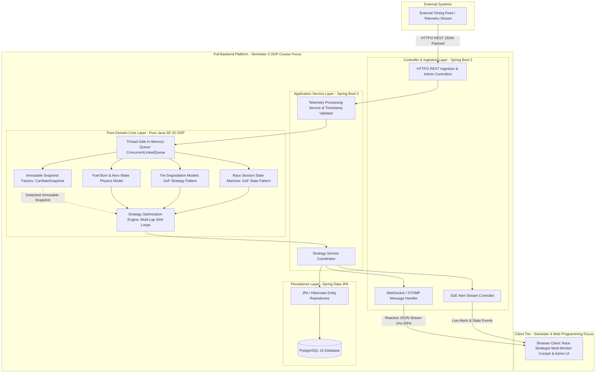
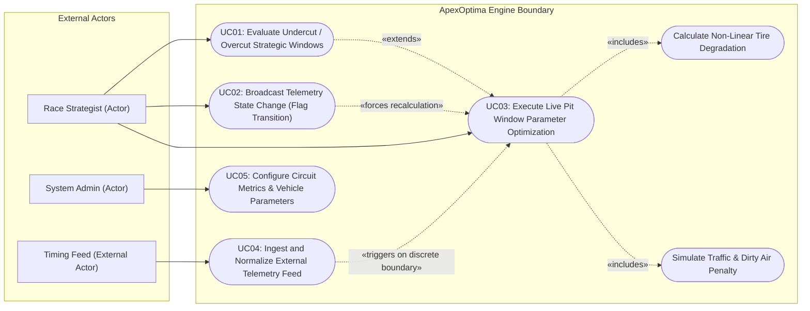

# Software Requirements Specification (SRS)
## ApexOptima: Real-Time Motorsport Strategy & Telemetry Engine

---

**Document Identifier:** SRS-AO-2026-V1.0  
**Project:** ApexOptima — Real-Time Motorsport Strategy & Telemetry Engine  
**Author & System Architect:** Henry Maia Fagundes  
**Role:** Lead Software Engineer & System Architect  
**Initial Baseline Date:** August 24, 2026  
**Status:** Approved / Baseline Production Specification  
**Standard Adherence:** IEEE Std 830-1998 & ISO/IEC/IEEE 29148:2018  

---

### Document Revision History

| Version | Date | Author | Description of Changes |
| :--- | :--- | :--- | :--- |
| **1.0** | August 24, 2026 | Henry Maia Fagundes | Initial baseline release establishing the IEEE Std 830-1998 standard, Layered Object-Oriented Architecture, two-semester academic roadmap (Semester 3: OOP Backend Platform; Semester 4: Web Programming Frontend Cockpit), mathematical domain physics, GoF design patterns, and formal verification matrices. |

---

## Table of Contents

1. [Introduction](#1-introduction)
   - 1.1 [Purpose](#11-purpose)
   - 1.2 [Document Conventions](#12-document-conventions)
   - 1.3 [Intended Audience and Reading Suggestions](#13-intended-audience-and-reading-suggestions)
   - 1.4 [Product Scope](#14-product-scope)
   - 1.5 [Definitions, Acronyms, and Abbreviations](#15-definitions-acronyms-and-abbreviations)
   - 1.6 [References](#16-references)
   - 1.7 [Overview of Document](#17-overview-of-document)
2. [Overall Description](#2-overall-description)
   - 2.1 [Product Perspective](#21-product-perspective)
     - 2.1.1 [System Context & Layered Architectural Decomposition](#211-system-context--layered-architectural-decomposition)
     - 2.1.2 [Two-Semester Academic & Technical Roadmap](#212-two-semester-academic--technical-roadmap)
   - 2.2 [Product Functions (Executive Summary)](#22-product-functions-executive-summary)
   - 2.3 [User Classes and Characteristics](#23-user-classes-and-characteristics)
   - 2.4 [Operating Environment](#24-operating-environment)
   - 2.5 [Design and Implementation Constraints](#25-design-and-implementation-constraints)
   - 2.6 [User Documentation](#26-user-documentation)
   - 2.7 [Assumptions and Dependencies](#27-assumptions-and-dependencies)
   - 2.8 [Deferred Requirements & Future Scope](#28-deferred-requirements--future-scope)
3. [Specific Requirements](#3-specific-requirements)
   - 3.1 [External Interface Requirements](#31-external-interface-requirements)
     - 3.1.1 [User Interfaces](#311-user-interfaces)
     - 3.1.2 [Hardware Interfaces](#312-hardware-interfaces)
     - 3.1.3 [Software Interfaces](#313-software-interfaces)
     - 3.1.4 [Communications Interfaces](#314-communications-interfaces)
   - 3.2 [Functional Requirements (FR)](#32-functional-requirements-fr)
     - 3.2.1 [Telemetry Ingestion & Preprocessing (FR-TEL)](#321-telemetry-ingestion--preprocessing-fr-tel)
     - 3.2.2 [Physics & Simulation Domain Logic (FR-SIM)](#322-physics--simulation-domain-logic-fr-sim)
     - 3.2.3 [Pit Strategy Optimization (FR-OPT)](#323-pit-strategy-optimization-fr-opt)
     - 3.2.4 [Session State Management (FR-STA)](#324-session-state-management-fr-sta)
     - 3.2.5 [Real-Time Notification & Streaming (FR-NOT)](#325-real-time-notification--streaming-fr-not)
     - 3.2.6 [System Administration & Calibration (FR-ADM)](#326-system-administration--calibration-fr-adm)
   - 3.3 [Non-Functional Requirements (NFR)](#33-non-functional-requirements-nfr)
     - 3.3.1 [Performance Requirements (NFR-PERF)](#331-performance-requirements-nfr-perf)
     - 3.3.2 [Architecture & Structural Quality (NFR-ARCH)](#332-architecture--structural-quality-nfr-arch)
     - 3.3.3 [Communication & Streaming Fidelity (NFR-COMM)](#333-communication--streaming-fidelity-nfr-comm)
     - 3.3.4 [Numerical Precision & Computational Integrity (NFR-PREC)](#334-numerical-precision--computational-integrity-nfr-prec)
     - 3.3.5 [Reliability & Fault Tolerance (NFR-RELI)](#335-reliability--fault-tolerance-nfr-reli)
     - 3.3.6 [Security & Access Control (NFR-SEC)](#336-security--access-control-nfr-sec)
   - 3.4 [Layered Architecture & OOP Design Mandates](#34-layered-architecture--oop-design-mandates)
4. [Deep-Dive Domain Modeling & Business Rules](#4-deep-dive-domain-modeling--business-rules)
   - 4.1 [System Use Cases](#41-system-use-cases)
     - 4.1.1 [Use Case Diagram](#411-use-case-diagram)
     - 4.1.2 [UC01: Evaluate Undercut/Overcut Strategic Windows](#412-uc01-evaluate-undercutovercut-strategic-windows)
     - 4.1.3 [UC02: Broadcast Telemetry State Change (Session Flag Transition)](#413-uc02-broadcast-telemetry-state-change-session-flag-transition)
     - 4.1.4 [UC03: Execute Live Pit Window Parameter Optimization](#414-uc03-execute-live-pit-window-parameter-optimization)
     - 4.1.5 [UC04: Ingest and Normalize External Telemetry Feed](#415-uc04-ingest-and-normalize-external-telemetry-feed)
     - 4.1.6 [UC05: Configure Circuit Metrics and Base Vehicle Parameters](#416-uc05-configure-circuit-metrics-and-base-vehicle-parameters)
   - 4.2 [Advanced Mathematical Business Rules (BR)](#42-advanced-mathematical-business-rules-br)
     - 4.2.1 [Category A: Sporting Regulation Compliance](#421-category-a-sporting-regulation-compliance)
     - 4.2.2 [Category B: Physics, Strategy Optimization & Domain Logic](#422-category-b-physics-strategy-optimization--domain-logic)
     - 4.2.3 [Category C: Telemetry Stream Validation & State Synchronization](#423-category-c-telemetry-stream-validation--state-synchronization)
5. [Verification, Validation & Traceability Matrix](#5-verification-validation--traceability-matrix)
   - 5.1 [Requirements Traceability Matrix (RTM)](#51-requirements-traceability-matrix-rtm)
   - 5.2 [Verification Methodologies](#52-verification-methodologies)
6. [Document Approval & Sign-Off](#6-document-approval--sign-off)

---

## 1. Introduction

### 1.1 Purpose
This Software Requirements Specification (SRS) document provides a complete, rigorous, and unambiguous description of the requirements, architecture boundaries, mathematical models, and operational behaviors for **ApexOptima: Real-Time Motorsport Strategy & Telemetry Engine**. 

ApexOptima is conceived and engineered as an advanced university project developed across two academic semesters:
- **Semester 3 (Object-Oriented Programming Course):** Engineering the full backend platform, pure Java SE 25 Object-Oriented domain core, mathematical simulation algorithms, Spring Boot 3 service layer, PostgreSQL relational persistence with JPA/Hibernate, and WebSocket streaming infrastructure.
- **Semester 4 (Web Programming Course):** Developing the interactive web application, multi-monitor Race Strategist cockpit dashboard, client-side real-time streaming, and rich telemetry data visualizations.

This document serves as the binding technical baseline, adhering strictly to the **IEEE Std 830-1998** recommended practice for SRS documentation.

### 1.2 Document Conventions
This document adheres to the following structural and stylistic conventions:
- **Requirement Categorization & Tagging:**
  - `FR-XXX-YY`: Functional Requirement, where `XXX` denotes the functional subsystem and `YY` is a sequential numeric identifier.
  - `NFR-XXX-YY`: Non-Functional Requirement, categorized by architectural quality attributes (`PERF`, `ARCH`, `COMM`, `PREC`, `RELI`, `SEC`).
  - `BR-CAT-YY`: Business Rule, categorized into Sporting Regulations (`BR-SPT-YY`), Strategic & Physical Domain Logic (`BR-STR-YY`), and Telemetry Validation & Synchronization (`BR-TEL-YY`).
  - `UC-YY`: Formal Use Case specification.
- **Requirement Weight & Modality (RFC 2119 / IEEE 830):**
  - **SHALL / MUST:** Mandatory, non-negotiable core capability.
  - **SHOULD:** Highly recommended architectural enhancement.
  - **MAY:** Optional or configurable operational behavior.
- **Mathematical Notation:** All physics formulas, degradation decay curves, and probabilistic optimization matrices are expressed using formal mathematical LaTeX notation.
- **Precision:** Units of time are measured in seconds ($s$) and integer milliseconds ($ms$), fuel mass in kilograms ($kg$) and volume in liters ($L$), and velocity in kilometers per hour ($km/h$) or meters per second ($m/s$).

### 1.3 Intended Audience and Reading Suggestions
This document is targeted toward the following reader groups:
- **Academic Evaluators & Professors:** Review [Section 2.1](#21-product-perspective), [Section 3.4](#34-layered-architecture--oop-design-mandates), and [Section 4](#4-deep-dive-domain-modeling--business-rules) for defensible Object-Oriented design, GoF design patterns, layered separation of concerns, and clean domain isolation.
- **Race Strategists & Simulation Engineers:** Review [Section 4.2](#42-advanced-mathematical-business-rules-br) for mathematical physics models, non-linear tire decay curves, Parc Fermé fuel constraints, and aerodynamic wake penalties.
- **Backend & Web Developers:** Review [Section 3.1](#31-external-interface-requirements), [Section 3.2](#32-functional-requirements-fr), and [Section 3.3](#33-non-functional-requirements-nfr) for API payloads, zero-allocation memory models, WebSocket framing, and database persistence bridges.
- **Quality Assurance & Verification Teams:** Review [Section 5](#5-verification-validation--traceability-matrix) for the verification matrix, boundary value tolerances, and automated testing criteria.

### 1.4 Product Scope
ApexOptima is an enterprise-grade motorsport strategy engine designed to ingest live, simulated, or recorded 20-car grid telemetry streams and produce sub-100ms real-time tactical pit stop recommendations. 

The software encompasses:
1. **Full Backend Platform & Simulation Engine (Semester 3 — Object-Oriented Programming Course):**
   - **Pure Java SE 25 Domain Core:** Domain entities (`Car`, `Driver`, `Lap`, `Session`, `Circuit`), immutable snapshots (`CarStateSnapshot`), and GoF design patterns (**Strategy Pattern** for tire compounds, **State Pattern** for session flags).
   - **Physics & Strategy Algorithms:** Mathematical modeling of fuel mass lap pace reduction, dirty air aerodynamic wake penalties, non-linear quadratic tire degradation with thermal cliff steps, and multi-lap stint optimization loops.
   - **Enterprise Spring Boot 3 Backend:** Application service layer orchestrating workflows, dependency injection, and REST controllers for telemetry ingestion and session management.
   - **Relational Persistence (PostgreSQL & Spring Data JPA):** Relational schema and Hibernate mappings for persistent storage of circuits, historical lap data, sector split times, and telemetry logs.
   - **Real-Time Messaging Infrastructure:** Server-side WebSocket (STOMP over RFC 6455) message brokers and Server-Sent Events (SSE) dispatchers.
   - **Automated Verification:** Comprehensive test suite with standalone JUnit 5 unit tests for domain physics and Spring Boot integration tests for repositories and controllers.
2. **Interactive Web Application & Strategist Dashboard (Semester 4 — Web Programming Course):**
   - **Strategist Command Cockpit UI:** Modern, responsive Single-Page Application (SPA) optimized for multi-monitor desktop environments.
   - **Client-Side Real-Time Streaming:** Resilient WebSocket (STOMP) and SSE client ingestion with live state caching, automatic reconnection, and exponential backoff.
   - **Data Visualizations & Tactical Controls:** Dynamic gap-to-leader charts, live non-linear tire wear curves with cliff alarms, forward-looking undercut/overcut tactical window graphs, and admin forms for live flag overrides and track calibrations.
   - **End-to-End Evaluation:** User acceptance testing (UAT) and full Grand Prix simulation playback.

**Out of Scope for Initial Release:**
- Direct CAN-bus hardware serial decoding at the trackside ECU level (all ingestion occurs via normalized JSON/REST bridges).
- 3D spatial vehicle rendering / visual WebGL track geometry engines (deferred to future milestones).
- Dynamic weather radar satellite integration (track dampness/temperature parameters are ingested through the calibrated telemetry stream or manual admin injection).

### 1.5 Definitions, Acronyms, and Abbreviations

| Acronym / Term | Definition |
| :--- | :--- |
| **BR** | Business Rule (International standard replacing Portuguese RN). |
| **DDD** | Domain-Driven Design — architectural approach centering software design on pure business logic. |
| **DRS** | Drag Reduction System — aerodynamic mechanism reducing drag to facilitate overtaking when within 1.0s gap. |
| **DTI** | Delta Time Interval — time differential between two competing vehicles on track. |
| **FIA** | Fédération Internationale de l'Automobile — governing body for world motorsport. |
| **FR** | Functional Requirement (International standard replacing Portuguese RF). |
| **JPA** | Java Persistence API / Jakarta Persistence Standard. |
| **LTV** | Lap Time Variance — mathematical spread between a vehicle's actual lap time and its theoretical optimal pace. |
| **NFR** | Non-Functional Requirement (International standard replacing Portuguese RNF). |
| **OOP** | Object-Oriented Programming — paradigm based on objects containing data and encapsulation methods. |
| **Overcut** | Racing strategy where a driver remains on track longer before pitting, exploiting clean air to gain track position. |
| **Parc Fermé** | Scrutineering condition mandating a vehicle retain a minimum unburned fuel volume for post-session compliance checks. |
| **RBAC** | Role-Based Access Control. |
| **RTM** | Requirements Traceability Matrix. |
| **SC** | Safety Car — physical deployment neutralizing the race pace across all sectors. |
| **SPA** | Single-Page Application — responsive web application executing dynamically in the browser. |
| **SRS** | Software Requirements Specification. |
| **SSE** | Server-Sent Events — unidirectional HTTP server-to-client streaming standard. |
| **STOMP** | Simple Text Oriented Messaging Protocol — sub-protocol layered over WebSocket. |
| **Undercut** | Racing strategy where a trailing driver pits earlier than the rival to leverage fresh tire pace to overtake during the rival's in-lap/out-lap. |
| **VSC** | Virtual Safety Car — sector-based speed delta enforcement without physical course car deployment. |
| **Wake / Dirty Air** | Aerodynamic turbulence trailing a lead car, inducing reduced downforce and elevated thermal tire degradation in following cars. |

### 1.6 References
1. **IEEE Std 830-1998:** *IEEE Recommended Practice for Software Requirements Specifications*, IEEE Computer Society, 1998.
2. **ISO/IEC/IEEE 29148:2018:** *Systems and software engineering — Life cycle processes — Requirements engineering*, International Organization for Standardization / IEEE, 2018.
3. **FIA Formula One Sporting Regulations (2026 Edition):** *Articles 28 (Tire Usage & Allocations), 39 (Safety Car Procedures), 40 (Virtual Safety Car Procedures), and 54 (Fuel & Parc Fermé Sampling)*, Fédération Internationale de l'Automobile.
4. **Gamma, E., Helm, R., Johnson, R., & Vlissides, J. (1994):** *Design Patterns: Elements of Reusable Object-Oriented Software*, Addison-Wesley Professional.
5. **Martin, R. C. (2017):** *Clean Architecture: A Craftsman's Guide to Software Structure and Design*, Prentice Hall.
6. **Evans, E. (2003):** *Domain-Driven Design: Tackling Complexity in the Heart of Software*, Addison-Wesley.
7. **RFC 6455:** *The WebSocket Protocol*, Internet Engineering Task Force (IETF), 2011.

### 1.7 Overview of Document
The remainder of this specification is organized as follows:
- **Section 2 (Overall Description):** Delineates the system context, layered architecture, user roles, operational environment, zero-allocation memory constraints, and semester-by-semester project trajectory.
- **Section 3 (Specific Requirements):** Formulates all external interface requirements, itemized functional requirements (`FR`), and rigorous non-functional requirements (`NFR`).
- **Section 4 (Deep-Dive Domain Modeling & Business Rules):** Expands formal Use Case specifications (with execution cadences, snapshot isolation, and UML diagrams) and formalizes mathematical business rules (`BR`) across sporting, physical, and telemetry layers.
- **Section 5 (Verification & Traceability):** Provides the Requirements Traceability Matrix (RTM) and verification methodologies.
- **Section 6 (Approval):** Contains the formal baseline sign-off record.

---

## 2. Overall Description

### 2.1 Product Perspective

#### 2.1.1 System Context & Layered Architectural Decomposition
ApexOptima operates as an autonomous, high-throughput computational backend and interactive pit-wall tactical dashboard. The software is constructed according to **Layered Architecture & Separation of Concerns** principles to guarantee clear encapsulation and testability:

1. **Presentation / Web Layer (Semester 4):** Browser-based Single-Page Application (SPA) communicating over HTTP/2 REST and WebSockets (STOMP).
2. **Controller & Ingestion Layer (Semester 3):** Spring Boot REST controllers and WebSocket message handlers receiving telemetry payloads and dispatching commands.
3. **Application Service Layer (Semester 3):** Service coordinators managing transaction boundaries, event dispatching, and strategy workflows.
4. **Pure Domain Core Layer (Semester 3):** Framework-agnostic pure Java SE 25 domain entities, mathematical physics models, GoF Strategy/State design patterns, and immutable state snapshots (`CarStateSnapshot`).
5. **Persistence / Repository Layer (Semester 3):** Spring Data JPA repositories and Hibernate mappings persisting entity states to PostgreSQL 16+.

To eliminate thread contention between high-frequency (20Hz) telemetry ingestion and multi-lap optimization loops, the architecture enforces the **Immutable Snapshot Pattern**. Continuous ingestion updates thread-safe collections, while optimization engines evaluate detached `CarStateSnapshot` records asynchronously.



#### 2.1.2 Two-Semester Academic & Technical Roadmap
To fulfill rigorous software engineering and computer science pedagogical standards, the development lifecycle is structured across two distinct, milestone-driven phases:

1. **Semester 3 — Object-Oriented Programming Course (Full Backend Platform):**
   - **Pure Java SE 25 Domain Core:** Domain entities (`Car`, `Driver`, `Lap`, `Session`, `Circuit`), immutable value snapshots (`CarStateSnapshot`), and GoF design patterns (**Strategy Pattern** for tire compound decay algorithms, **State Pattern** for track flag condition transitions).
   - **Mathematical Physics & Concurrency:** Thread-safe concurrent queues (`ConcurrentLinkedQueue`), timestamp ordering validation, rolling median noise filters, fuel mass lap pace reduction, dirty air aerodynamic wake penalties, and non-linear tire decay curves.
   - **Zero-Allocation Hot-Paths:** Primitive and fixed-point data representation (`double`, `long` milliseconds) ensuring JVM GC pauses remain $<10\text{ms}$.
   - **Enterprise Infrastructure (Spring Boot 3 & PostgreSQL):** Spring Boot 3 service layer with dependency injection; relational persistence schema with PostgreSQL 16+ and Spring Data JPA / Hibernate for telemetry archiving, lap history, and circuit calibrations.
   - **Reactive Real-Time Streaming Server:** Full-duplex WebSocket (STOMP over RFC 6455) message broker and Server-Sent Events (SSE) dispatchers for pushing sub-100ms strategy updates.
   - **Automated Testing:** 100% unit and integration test coverage via standalone JUnit 5 and Spring Boot integration tests.

2. **Semester 4 — Web Programming Course (Frontend Cockpit & Full-Stack Integration):**
   - **Strategist Command Cockpit UI:** Responsive Single-Page Application (SPA) optimized for multi-monitor desktop environments, delivering real-time pit-wall visualization.
   - **Client-Side Reactive Streaming:** Resilient WebSocket (STOMP) and SSE client ingestion with automatic reconnection, exponential backoff, and local reactive state caching.
   - **Advanced Telemetry Visualizations:** Interactive real-time gap-to-leader/delta charts, non-linear tire wear curves with "cliff" alerts, forward-looking undercut/overcut tactical window graphs, and countdown timers.
   - **Interactive Pit-Wall Tactical Controls:** Strategist command interfaces (manual SC/VSC flag overrides, target rival selection, delta tolerance threshold tuning) sending live commands to backend endpoints.
   - **System Administration & Track Calibration Portal:** Pre-race UI forms for circuit parameters, surface abrasiveness, and base car performance matrices with live validation.
   - **End-to-End Simulation & User Acceptance Testing (UAT):** Grand Prix session simulation playback and full user-in-the-loop evaluation.

### 2.2 Product Functions (Executive Summary)
ApexOptima executes five fundamental functional responsibilities:
1. **High-Frequency Telemetry Ingestion & Invariant Filtering:** Consumes 20-car grid timing telemetry (1Hz to 20Hz) via HTTP/2 REST, filters sensor jitter through rolling median algorithms, and normalizes continuous packets while immediately reconciling discrete lifecycle events.
2. **Dynamic Tire Degradation Modeling (Strategy Pattern):** Computes compound-specific non-linear pace drop-off using interchangeable Strategy Pattern classes (`SoftCompoundStrategy`, `MediumCompoundStrategy`, `HardCompoundStrategy`) calibrated to track temperature and surface abrasiveness.
3. **Aerodynamic Wake & Fuel Burn Simulation:** Dynamically scales lap-time lap deltas based on fuel mass burn-off ($0.035s/kg$) and applies aerodynamic wake penalties when a vehicle runs within $1.2s$ of leading traffic.
4. **Dual-Cadence Pit Strategy Optimization (Undercut/Overcut Matrix):** Executes lightweight continuous delta tracking at 20Hz and discrete multi-lap forward simulation loops upon sector/lap completions or flag changes, projecting track re-entry slots and issuing high-priority pit window alerts.
5. **Stateful Session Regulation Enforcement (State Pattern):** Enforces dynamic time-loss invariant adjustments across Green Flag, Virtual Safety Car (VSC), and full Safety Car (SC) states via the GoF State Pattern.

### 2.3 User Classes and Characteristics

| User Class | Technical Expertise | Role & Operational Objective | System Interaction Privileges |
| :--- | :--- | :--- | :--- |
| **Race Strategist (Primary User)** | Advanced domain knowledge in motorsport strategy, physics, and telemetry analysis. | Monitors live gap charts, approves or overrides undercut/overcut recommendations, configures tactical pit stops, and triggers manual race flag overrides. | Access to live strategist dashboard, execution of real-time simulations, manual session state transition controls, threshold fine-tuning. |
| **System Administrator (Technical Lead)** | High software engineering and database proficiency. | Manages circuit parameters (lap length, baseline pit lane loss, abrasiveness coefficient), vehicle baseline models, and API configurations. | Full CRUD access to administrative endpoints, circuit calibration tables, database backup utilities, and system health monitors. |
| **External Timing Feed (System Actor)** | Automated machine-to-machine streaming system. | Pushes continuous telemetry arrays (sector splits, speed trap speeds, tire life counters, fuel consumption estimates) and discrete race lifecycle events. | HTTP/2 REST ingestion endpoint access; restricted to signed data-ingestion payloads. |

### 2.4 Operating Environment
The ApexOptima system operates across the following operational baseline:
- **Server-Side Computing Environment (Semester 3 Backend Platform):**
  - Runtime: OpenJDK 25 (64-bit).
  - Framework: Spring Boot 3.3+ (Application Services & Controllers).
  - Persistence: PostgreSQL 16+ with connection pooling (HikariCP) and Spring Data JPA / Hibernate 6+.
  - Real-Time Messaging: Spring WebSocket (STOMP over RFC 6455) and HTTP/2 Server-Sent Events (SSE).
  - Containerization: OCI-compliant Docker containers running on Linux (Ubuntu Server 22.04 LTS / RHEL 9).
  - Target Minimum Hardware: 4 vCPUs, 8 GB RAM, high-speed NVMe storage.
- **Client-Side Strategist Environment (Semester 4 Web Application):**
  - Architecture: Modern Single-Page Web Application (SPA) utilizing reactive state management and responsive multi-display grid layouts.
  - Modern Evergreen Desktop Browsers: Google Chrome 120+, Mozilla Firefox 122+, Microsoft Edge 120+.
  - Display Capabilities: Optimized for multi-monitor desktop configurations ($1920 \times 1080$ minimum per viewport, $3840 \times 2160$ recommended).

### 2.5 Design and Implementation Constraints
1. **Layered Decoupling Constraint:** The pure domain core classes SHALL NOT import or reference any framework packages (`org.springframework.*`, `jakarta.persistence.*`, `org.hibernate.*`). All application coordination must occur across clean service boundaries.
2. **Computational Precision & Primitive Hot-Path Representation:** Floating-point rounding errors are catastrophic in competitive motorsport strategy. Continuous telemetry processing, physics integration, lap time calculations, gap intervals, and pit deltas MUST be computed using primitive 64-bit floating-point numbers (`double`) and fixed-point integer milliseconds (`long`) (e.g., `long lapTimeMillis`, `long gapDeltaMillis`, `double fuelMassKg`, `double speedKph`). This guarantees zero cumulative numerical drift over a 70-lap Grand Prix distance ($\le \pm 0.001\text{s}$ tolerance) while eliminating object instantiation overhead.
3. **Zero-Allocation Hot-Path & Deterministic Memory Management:** The core domain engine SHALL avoid heap object allocations inside the 20Hz continuous ingestion and pace calculation loops. Telemetry queues, rolling median filters, and car state representations must rely on primitive arrays and reusable/immutable Java `Record` value snapshots (`CarStateSnapshot`), ensuring JVM Garbage Collection (GC) pause times remain strictly below **$10\text{ms}$** ($T_{GC} < 10\text{ms}$) under steady-state operation.
4. **Standardized Transport Protocols:** Telemetry ingestion and system administration SHALL operate strictly via **HTTP/2 REST** JSON payloads. Live client updates SHALL stream over **WebSockets (STOMP over RFC 6455)** with automatic fallback to **Server-Sent Events (SSE)**. Raw UDP networking is excluded to guarantee standard transport reliability, HTTP/2 multiplexing, and robust security semantics.

### 2.6 User Documentation
The system deliverables shall include:
- **System Architecture & Developer Reference Manual:** Detailing the layered package hierarchy, class diagrams, GoF design pattern implementations, snapshot lifecycle, and extension points.
- **Race Strategist User Guide:** Operational manual explaining delta charts, undercut probability indexes, pit window alarms, and session state overrides.
- **REST & WebSocket API OpenAPI/AsyncAPI Specifications:** Complete interactive schemas detailing all JSON payload contracts and event channels.

### 2.7 Assumptions and Dependencies
1. **Network Reliability:** External telemetry streaming relies on an operational local or wide-area network connection with latency under $50\text{ms}$.
2. **Simulated Timing Feed Fidelity:** Simulated JSON timing feeds accurately mirror standard FIA sector timing topologies (Sector 1, Sector 2, Sector 3, Pit In, Pit Out, Speed Traps).
3. **Driver Compliance:** Optimization algorithms assume baseline human driver adherence to delta target times within $\pm 0.200\text{s}$ unless marked with tire distress or mechanical degradation flags.

### 2.8 Deferred Requirements & Future Scope
The following capabilities are recognized as valuable extensions but are explicitly deferred to post-capstone production releases:
- **REQ-DEF-01: Live Meteorological Radar Injection:** Automated ingestion of Doppler precipitation scans and high-resolution atmospheric barometric pressure feeds.
- **REQ-DEF-02: 3D WebGL Vehicle Spatial Mapping:** Real-time visual reconstruction of absolute GPS vehicle coordinates mapped onto 3D LIDAR circuit scans.
- **REQ-DEF-03: Machine Learning Neural Pace Prediction:** Deep neural network models predicting localized track rubbering-in dynamics based on multi-year historical telemetry datasets.

---

## 3. Specific Requirements

### 3.1 External Interface Requirements

#### 3.1.1 User Interfaces
- **UI-01 (Race Strategist Command Cockpit):**
  - **Live Multi-Car Gap Chart:** Visual matrix rendering real-time interval deltas between all 20 vehicles, color-coded by compound and tire age.
  - **Pit Window Strategy Advisor:** Interactive panel indicating the optimal pit stop lap, projected track re-entry gap, and undercut success probability percentage ($0.0\% - 100.0\%$).
  - **Session Control Toolbar:** Toggle buttons enabling manual override of race flag states (Green, VSC, SC, Red Flag).
- **UI-02 (System Administration & Track Calibration Panel):**
  - Form interfaces to configure circuit length ($m$), base pit lane transit time loss ($s$), pit stop service stationary time ($s$), track abrasiveness index ($0.5 - 2.0$), and baseline ambient temperature ($^\circ\text{C}$).

#### 3.1.2 Hardware Interfaces
- The software runs on standard x86-64 and ARM64 server architectures. All communications interface over standard TCP/IP network sockets.

#### 3.1.3 Software Interfaces
- **SI-01 (Database Persistence Interface):**
  - Database: PostgreSQL 16+ via JDBC 4.3 drivers.
  - ORM Layer: Hibernate 6+ / Spring Data JPA executing batch writes for historical lap archiving.
- **SI-02 (External Timing Feed Ingestion Interface):**
  - RESTful HTTP/2 JSON Ingestion Endpoint accepting array payloads containing timestamped car records and discrete lifecycle events (`POST /api/v1/telemetry/feed`).

#### 3.1.4 Communications Interfaces
- **CI-01 (WebSocket Real-Time Broadcast):**
  - Protocol: STOMP over RFC 6455 WebSockets.
  - Endpoint: `/ws/telemetry` with subscriptions on `/topic/strategy-updates`, `/topic/car-telemetry/{carId}`, and `/topic/session-alerts`.
  - Frame Payload: Minified UTF-8 JSON payloads with packet sizes $\le 2\text{ KB}$.
- **CI-02 (Server-Sent Events Broadcast):**
  - Protocol: HTTP/2 SSE (`text/event-stream`).
  - Endpoint: `/api/v1/stream/pit-alerts` for unidirectional high-priority strategical notifications.

---

### 3.2 Functional Requirements (FR)

#### 3.2.1 Telemetry Ingestion & Preprocessing (FR-TEL)

##### FR-TEL-01: HTTP/2 JSON Telemetry Ingestion
- **Description:** The system SHALL ingest continuous telemetry payloads representing the 20-car grid at frequencies ranging from 1Hz to 20Hz via HTTP/2 REST endpoints.
- **Detailed Specification:**
  - The ingestion controller shall accept JSON payloads containing: `sessionTime`, `carId`, `lapNumber`, `currentSector` (1, 2, 3), `sectorTimeMillis`, `speedTrapKph`, `currentCompound`, `tireAgeLaps`, `fuelRemainingKg`, and `currentFlagState`.
  - The ingestion adapter shall parse incoming payloads into thread-safe, immutable Java `Record` value snapshots (`CarStateSnapshot`) within the domain core.
- **Pass/Fail Criteria:** Payloads containing 20 car updates are completely unmarshaled into domain value objects in under $5\text{ms}$.

##### FR-TEL-02: Telemetry Outlier Suppression & Jitter Filtering
- **Description:** The system SHALL filter sensor noise, transmission jitter, and physically impossible outliers from continuous telemetry feeds before updating car state models.
- **Detailed Specification:**
  - Implement a primitive rolling median filter over a sliding window of size $N=5$ samples for speed and sector delta values.
  - The system shall reject speed readings outside the physical envelope ($0.0\text{ km/h} \le v \le 420.0\text{ km/h}$) and sector times deviating by $> 50\%$ from the 3-lap rolling average without an active flag state change.
- **Pass/Fail Criteria:** Artificially injected $800\text{ km/h}$ speed spikes are dropped with an error log, preserving the existing vehicle state trajectory.

##### FR-TEL-03: Event Timestamp Validation & Lifecycle Reconciliation
- **Description:** The system SHALL validate continuous packet arrival timestamps while ensuring discrete lifecycle events immediately trigger state reconciliation.
- **Detailed Specification:**
  - **Continuous Telemetry:** The system shall validate packet timestamps against an acceptable late-arrival window ($500\text{ms}$). Packets arriving older than $500\text{ms}$ shall be logged to the database with a `LATE_PACKET` flag and dropped from live pace tracking.
  - **Discrete Lifecycle Events (`PIT_IN`, `PIT_OUT`, `RETIRED`, `FLAG_CHANGE`):** Discrete events MUST bypass continuous packet dropping. Regardless of transmission arrival delay, discrete events always trigger immediate state reconciliation, vehicle flag mutation, and global strategy re-evaluation sweeps.

---

#### 3.2.2 Physics & Simulation Domain Logic (FR-SIM)

##### FR-SIM-01: Dynamic Tire Degradation Strategy Pattern Modeling
- **Description:** The system SHALL compute non-linear lap time degradation for each car using an object-oriented **GoF Strategy Design Pattern**.
- **Detailed Specification:**
  - Define a domain interface `TireDegradationStrategy` with concrete implementations: `SoftCompoundStrategy`, `MediumCompoundStrategy`, `HardCompoundStrategy`, `IntermediateCompoundStrategy`, and `WetCompoundStrategy`.
  - The strategy classes shall be dynamically hot-swappable at runtime without recreating the `Car` entity when a pit stop occurs.
  - Degradation must be modeled as a non-linear quadratic/exponential function incorporating track temperature ($^\circ\text{C}$) and track abrasiveness factors using primitive `double` math.
- **Pass/Fail Criteria:** Strategy pattern implementations produce calculated lap times matching theoretical degradation curves within $\pm 0.001\text{s}$.

##### FR-SIM-02: Fuel Mass Burn & Dynamic Lap Time Calculation
- **Description:** The system SHALL calculate fuel mass consumption per lap and compute the corresponding lap time pace advantage gained through mass reduction.
- **Detailed Specification:**
  - Base vehicle lap time shall decrease by a configurable fuel effect coefficient $\delta_{fuel}$ (default: $0.035\text{s}$ per $1.0\text{ kg}$ of fuel consumed).
  - Fuel consumption per lap shall be dynamically adjusted based on session state (Green Flag = $100\%$ burn rate; VSC = $65\%$ burn rate; SC = $50\%$ burn rate).
  - The engine shall calculate total fuel load to the finish line and raise a critical warning if calculated reserve drops below the Parc Fermé threshold ($1.0\text{ L}$ / $0.800\text{ kg}$).

##### FR-SIM-03: Aerodynamic Wake & Dirty Air Congestion Penalty
- **Description:** The system SHALL apply aerodynamic wake penalties to any car running within $1.2\text{s}$ of a preceding vehicle.
- **Detailed Specification:**
  - When spatial gap $\Delta t \le 1.200\text{s}$ and the trailing car is not in clean air:
    - Base tire degradation rate shall increase by a configurable wake multiplier (default: $+25\%$).
    - Aerodynamic cornering grip factor shall decrease, applying a lap time penalty between $+0.150\text{s}$ and $+0.400\text{s}$ depending on the circuit's dirty air sensitivity index.
    - If the car is within $1.000\text{s}$ in an authorized DRS zone under Green Flag conditions, the DRS drag reduction offset (default: $-0.600\text{s}$ on straight sectors) shall be credited.

---

#### 3.2.3 Pit Strategy Optimization (FR-OPT)

##### FR-OPT-01: Dual-Cadence Pit Stop Window Optimization
- **Description:** The system SHALL execute a dual-cadence optimization architecture: continuous 20Hz pace tracking and discrete multi-lap forward simulation loops.
- **Detailed Specification:**
  - **Continuous 20Hz Cadence:** Calculates lightweight, constant-time $O(1)$ operations per car: rolling median pace smoothing, current-lap gap tracking, DRS proximity detection, and delta time interval updates.
  - **Discrete Boundary Cadence (Forward Horizon):** Multi-lap forward horizon optimization (evaluating viable pit laps $l_{pit} \in [l_{curr}, l_{total}]$ and compound stint combinations across the grid) is triggered exclusively on discrete session boundaries:
    1. Sector or lap completion boundaries.
    2. Vehicle pit lane entry (`PIT_IN`) or exit (`PIT_OUT`).
    3. Session flag state transitions (`GREEN`, `VSC`, `SC`, `RED`).
    4. Explicit manual strategist simulation requests.
  - Forward optimization SHALL execute via iterative multi-lap simulation loops comparing viable tire stints over detached, immutable `CarStateSnapshot` instances, ensuring execution completes within the $<100\text{ms}$ latency budget (`NFR-PERF-01`) without blocking ingestion.
  - The engine must compute track re-entry slots by mapping the target car's post-pit position against projected trajectories of all 19 rival cars, applying dirty air penalties if re-entry falls into traffic ($\Delta t \le 1.2\text{s}$).

##### FR-OPT-02: Undercut & Overcut Tactical Delta Evaluation
- **Description:** The system SHALL evaluate the mathematical feasibility and success probability of executing an Undercut or Overcut against specified rival cars.
- **Detailed Specification:**
  - The engine shall calculate the *Undercut Delta* ($\Delta_{undercut}$):
    $$\Delta_{undercut} = (T_{in} + T_{pit\_loss} + T_{out\_fresh}) - (T_{rival\_worn\_1} + T_{rival\_worn\_2})$$
  - The engine shall compute the *Probability of Position Gain* based on pit delta, out-lap warm-up curves, and rival tire wear gradients.
  - The results shall be published to the client dashboard within $100\text{ms}$ of any rival sector time update.

---

#### 3.2.4 Session State Management (FR-STA)

##### FR-STA-01: Stateful Track Condition Transitions (State Pattern)
- **Description:** The system SHALL maintain a state machine managing global track status: `GREEN_FLAG`, `YELLOW_FLAG`, `VIRTUAL_SAFETY_CAR`, `SAFETY_CAR`, and `RED_FLAG` using the **GoF State Pattern**.
- **Detailed Specification:**
  - Implement a `SessionState` interface with concrete classes: `GreenFlagState`, `SafetyCarState`, `VirtualSafetyCarState`, and `RedFlagState`.
  - State transitions must immediately propagate updated time-loss invariants across the entire simulation domain.
  - Under `GreenFlagState`: Pit lane time loss equals baseline circuit value $X_{green}$ (e.g., $21.5\text{s}$).
  - Under `VirtualSafetyCarState` and `SafetyCarState`: Effective pit stop delta loss drops to $Y_{sc}$ (e.g., $12.0\text{s}$) because on-track cars are limited by delta lap times, drastically reducing the relative penalty of traveling through the speed-limited pit lane.
- **Pass/Fail Criteria:** State transition triggers instant recalculation of all 20 cars' pit windows within the $<100\text{ms}$ latency boundary.

---

#### 3.2.5 Real-Time Notification & Streaming (FR-NOT)

##### FR-NOT-01: Real-Time Tactical Alert Dispatching
- **Description:** The system SHALL push high-priority tactical alerts to connected strategist dashboards when critical strategic conditions are met.
- **Detailed Specification:**
  - The system shall dispatch alerts over WebSocket (STOMP) and SSE when:
    1. A target car enters its optimal pit window ("BOX THIS LAP: Optimal Window Open").
    2. A rival enters the pit lane, opening a critical Undercut Defense window ("RIVAL PITTED: Push In-Lap Delta").
    3. Tire degradation passes the critical wear threshold / "cliff" ("TIRE CLIFF WARNING: Pace loss $> 1.8s/lap$").
    4. Parc Fermé fuel reserve is endangered ("FUEL CRITICAL: Conservation mode required").
- **Pass/Fail Criteria:** Alerts are transmitted to client sockets within $< 50\text{ms}$ of event detection.

---

#### 3.2.6 System Administration & Calibration (FR-ADM)

##### FR-ADM-01: Circuit & Vehicle Dynamic Calibration
- **Description:** The system SHALL provide administrative interfaces and HTTP/2 REST endpoints to configure circuit topography and baseline vehicle parameters.
- **Detailed Specification:**
  - Enable CRUD operations for Circuit Entities: `circuitId`, `name`, `lapDistanceMeters`, `totalLaps`, `basePitLossMillis`, `pitStopDurationMillis`, `abrasivenessFactor`, and `drsZonesCount`.
  - Enable calibration of Vehicle Performance Entities: `carId`, `teamName`, `driverNumber`, `basePaceModifier`, `fuelConsumptionPerLapKg`, and `tireWarmupLaps`.

---

### 3.3 Non-Functional Requirements (NFR)

#### 3.3.1 Performance Requirements (NFR-PERF)
- **NFR-PERF-01 (Calculation Latency Boundary):** Strategy recalculation for the entire 20-car grid upon a discrete session boundary (e.g., lap completion or Safety Car deployment) MUST execute in under **$100\text{ms}$** ($T_{calc} \le 100\text{ms}$) on baseline server hardware.
- **NFR-PERF-02 (Ingestion Throughput):** The system MUST support continuous ingestion of 20 concurrent vehicle telemetry streams at up to 20Hz (400 packets/second aggregate) via HTTP/2 REST with zero packet drop and CPU utilization $< 40\%$.
- **NFR-PERF-03 (Heap Allocation & Zero-Churn Hot-Path):** Ingestion and continuous 20Hz pace tracking pipelines MUST maintain zero steady-state heap object churn by utilizing primitive types (`double`, `long`), thread-safe queues, and lightweight immutable records, guaranteeing JVM Garbage Collection (GC) pauses stay strictly below **$10\text{ms}$** ($T_{GC} < 10\text{ms}$).

#### 3.3.2 Architecture & Structural Quality (NFR-ARCH)
- **NFR-ARCH-01 (Layered Separation of Concerns):** The core simulation domain engine SHALL be 100% free of external framework dependencies (Spring Boot, Hibernate, Jakarta EE). All domain entities, value objects, and business rules must compile and execute in a pure Java SE 25 environment.
- **NFR-ARCH-02 (Testability & Pure Unit Testing):** 100% of domain business logic, tire degradation algorithms, and strategy optimizers must be testable using lightweight JUnit 5 test suites without initializing a Spring ApplicationContext. Test execution for 500+ unit tests must complete in $< 3.0\text{ seconds}$.
- **NFR-ARCH-03 (Modularity, Concurrency & State Isolation):** The codebase shall enforce the **Immutable Snapshot Pattern** (`CarStateSnapshot`). Multi-lap forward simulations must execute asynchronously on detached snapshot instances without acquiring locks on the continuous telemetry ingestion queues.

#### 3.3.3 Communication & Streaming Fidelity (NFR-COMM)
- **NFR-COMM-01 (Full-Duplex Streaming & UI Non-Blocking):** WebSocket sessions must deliver live telemetry and strategy updates to client frontends at a guaranteed frequency of $\ge 1\text{Hz}$ using compact JSON frames ($\le 2\text{KB}$ per message) without triggering client-side browser thread locking or event loop lag.
- **NFR-COMM-02 (Connection Resilience):** The client-server communication layer must support automatic reconnection with exponential backoff (starting at $1.0\text{s}$, max $10.0\text{s}$) upon transient socket disconnection.

#### 3.3.4 Numerical Precision & Computational Integrity (NFR-PREC)
- **NFR-PREC-01 (Numerical Precision & Fixed-Point Integrity):** All continuous time deltas, gap computations, and cumulative pace simulations must utilize 64-bit primitive `double` and fixed-point integer milliseconds (`long`), guaranteeing zero cumulative numerical drift over a 70-lap Grand Prix distance ($\le \pm 0.001\text{s}$ or $1\text{ms}$ tolerance).
- **NFR-PREC-02 (Deterministic Execution):** Given an identical sequence of input telemetry packets and circuit calibration parameters, the simulation engine must produce byte-for-byte identical output strategy matrices.

#### 3.3.5 Reliability & Fault Tolerance (NFR-RELI)
- **NFR-RELI-01 (Graceful Degradation on Continuous Packet Drop):** In the event of network dropouts where up to 5 consecutive continuous telemetry packets for a vehicle are lost, the system SHALL extrapolate vehicle position and lap delta using a linear pace continuation model based on the prior 3-lap rolling average, flagging the data as `ESTIMATED` on the UI.
- **NFR-RELI-02 (System Availability):** The strategy backend service must maintain 99.9% availability during active race sessions.

#### 3.3.6 Security & Access Control (NFR-SEC)
- **NFR-SEC-01 (Role-Based Access Control):** Administrative calibration endpoints (`/api/v1/admin/**`) MUST require authenticated JWT tokens with `ROLE_ADMIN` authority.
- **NFR-SEC-02 (Input Sanitization):** All incoming HTTP/2 REST and JSON payloads must be validated against strict schema constraints to prevent injection attacks and memory exhaustion exploits.

---

### 3.4 Layered Architecture & OOP Design Mandates

The system architecture is structured strictly around **Layered Architecture & Separation of Concerns**. The package and module topology enforces the following structural rules:

```
+-------------------------------------------------------------------------+
| Presentation & Web Layer (Semester 4 - React / TS / STOMP WebSockets)   |
|   +-------------------------------------------------------------------+ |
|   | Controller & Ingestion Layer (Semester 3 - Spring Boot 3 REST/WS) | |
|   |   +-------------------------------------------------------------+ | |
|   |   | Application Service Layer (Semester 3 - Strategy Coordinators)| |
|   |   |   +-------------------------------------------------------+ | | |
|   |   |   | Pure Domain Core (Semester 3 - Java SE 25 Pure OOP)   | | | |
|   |   |   |   - Entities: Car, Driver, Lap, Session, Circuit      | | | |
|   |   |   |   - Immutable Snapshots: CarStateSnapshot, Records    | | | |
|   |   |   |   - Value Types: long millis, double speed, double kg | | | |
|   |   |   |   - GoF Strategy Pattern: TireDegradationStrategy     | | | |
|   |   |   |   - GoF State Pattern: SessionState (Green/VSC/SC)    | | | |
|   |   |   |   - Domain Services: PitOptimizer, WakeCalculator     | | | |
|   |   |   +-------------------------------------------------------+ | | |
|   |   +-------------------------------------------------------------+ | |
|   | Persistence Layer (Semester 3 - Spring Data JPA & PostgreSQL 16)  | |
|   +-------------------------------------------------------------------+ |
+-------------------------------------------------------------------------+
```

**Architectural & OOP Rules:**
1. **Layered Separation of Concerns:** Higher layers depend on lower layers; the Pure Domain Core does not depend on any outer framework or database library.
2. **Entity Purity:** Domain entities (`Car`, `Lap`, `Session`, `Circuit`) must not contain Spring or Hibernate annotations (`@Entity`, `@Table`, `@Autowired`).
3. **Data Mapping:** Persistence JPA entities must maintain a distinct schema and be mapped to/from pure domain models via dedicated Data Mappers.
4. **Concurrency & State Isolation (Immutable Snapshot Pattern):** Real-time telemetry ingestion updates thread-safe collections (`ConcurrentLinkedQueue`, `ConcurrentHashMap`). When multi-lap forward simulations are triggered, the domain captures an immutable `CarStateSnapshot` vector. Simulations execute asynchronously on detached snapshots without placing lock contention on ingestion.

---

## 4. Deep-Dive Domain Modeling & Business Rules

### 4.1 System Use Cases

#### 4.1.1 Use Case Diagram



---

#### 4.1.2 UC01: Evaluate Undercut/Overcut Strategic Windows
- **Primary Actor:** Race Strategist.
- **Pre-conditions:**
  - Active race session is loaded and live telemetry ingestion is streaming at $\ge 1\text{Hz}$.
  - Target car and at least one rival car are running within a competitive time window ($\Delta t \le 5.0\text{s}$).
- **Main Success Flow:**
  1. Race Strategist selects Target Car (e.g., Car #44) and Rival Car (e.g., Car #1) on the Strategy Dashboard.
  2. Race Strategist initiates "Evaluate Undercut Simulation".
  3. System captures an immutable `CarStateSnapshot` of both cars, retrieving current tire age, degradation gradient, fuel mass, and estimated pit lane time loss.
  4. System models the target car entering the pit lane on the current lap ($l_{curr}$), fitting a fresh compound (e.g., New Hard).
  5. System calculates target car's projected out-lap time ($T_{out}$) including tire warm-up delta.
  6. System models the rival car remaining on track on its current worn compound for 1 additional lap ($l_{curr} + 1$).
  7. System computes net track delta $\Delta_{undercut}$:
     $$\Delta_{undercut} = (T_{in} + T_{pit\_loss} + T_{out\_fresh}) - (T_{rival\_lap1} + T_{rival\_in} + T_{pit\_loss} + T_{rival\_out})$$
  8. System evaluates traffic clearance: projects whether the target car re-enters into a clean air gap or traffic bottleneck.
  9. System displays the net gap advantage, track position outcome, and confidence percentage ($0-100\%$) on the dashboard within $<100\text{ms}$.
- **Alternative Flows:**
  - *Alt Flow 1A (Continuous Packet Drop / Missing Telemetry):* If telemetry packets for the rival car are missing for $> 3\text{ seconds}$, the system extrapolates rival pace from historical rolling averages, annotates the simulation with a `CONFIDENCE_REDUCED: ESTIMATED_RIVAL_PACE` warning, and presents the result.
  - *Alt Flow 1B (Traffic Blockage Detected):* If projected re-entry falls $\le 0.8\text{s}$ behind a backmarker, the system flags `UNDERCUT_COMPROMISED: TRAFFIC_CONGESTION` and suggests an Overcut alternative.
- **Post-conditions:** Undercut/Overcut evaluation matrix is displayed on the UI and cached for comparison.

---

#### 4.1.3 UC02: Broadcast Telemetry State Change (Session Flag Transition)
- **Primary Actor:** Race Strategist (or automated Race Control telemetry trigger).
- **Pre-conditions:** Race session is in progress under `GreenFlagState`.
- **Main Success Flow:**
  1. Race Strategist selects "Virtual Safety Car" or "Safety Car" trigger on the dashboard toolbar.
  2. System receives the state change command and transitions the `SessionState` context (e.g., from `GreenFlagState` to `SafetyCarState`).
  3. System updates the global pit lane delta invariant from $X_{green}$ ($21.5\text{s}$) to $Y_{sc}$ ($12.0\text{s}$).
  4. System updates on-track target delta speeds (speed limited to VSC delta time or SC queue pace).
  5. Core strategy optimizer captures an immutable grid snapshot and triggers multi-lap forward simulation loops for all 20 cars.
  6. System identifies immediate pit opportunities ("Cheap Pit Stop Under SC").
  7. System streams the updated state and refreshed strategy matrix over WebSockets to all connected dashboards within $< 100\text{ms}$.
  8. System asynchronously logs the state transition event with millisecond timestamp to PostgreSQL persistence.
- **Alternative Flows:**
  - *Alt Flow 2A (Immediate Green Flag Resumption):* Session transitions back to `GreenFlagState`. System instantly restores baseline pit loss $X_{green}$ and normal fuel/tire physics models.
- **Post-conditions:** Race state updated; all pit strategies realigned to the reduced pit penalty invariant.

---

#### 4.1.4 UC03: Execute Live Pit Window Parameter Optimization
- **Primary Actor:** Automated Engine / Race Strategist.
- **Pre-conditions:** Live lap timing feed is active; cars are completing track sectors.
- **Execution Cadence:** Continuous 20Hz telemetry feeds lightweight delta tracking; multi-lap forward simulation triggers on discrete sector/lap completions or flag changes.
- **Main Success Flow:**
  1. External timing feed emits a discrete sector/lap completion event for a car.
  2. Telemetry ingestion updates the thread-safe in-memory queue and extracts a detached `CarStateSnapshot` vector.
  3. Strategy optimizer triggers forward-looking multi-lap simulation across remaining race laps ($L_{rem}$) using stint comparison loops.
  4. For every possible pit lap $k \in [1, L_{rem}]$ and compound $C \in \{\text{Soft}, \text{Medium}, \text{Hard}\}$:
     - Calculates compound tire decay per lap using `TireDegradationStrategy`.
     - Calculates fuel burn weight reduction per lap.
     - Projects cumulative race completion time.
  5. Identifies the global minimum race time strategy $S_{opt} = \min(T_{total})$.
  6. If current lap $l \in [l_{pit\_opt} - 1, l_{pit\_opt} + 1]$, system generates a high-priority "BOX THIS LAP" recommendation.
  7. Publishes optimization vector via WebSocket topic `/topic/strategy-updates`.
- **Alternative Flows:**
  - *Alt Flow 3A (Single Compound Violation):* If an optimal strategy only utilizes one dry compound in a dry race, the engine rejects the strategy per rule `BR-SPT-01` and evaluates the next best multi-compound permutation.
- **Post-conditions:** Strategist dashboard displays updated pit windows and tire stint graphs.

---

#### 4.1.5 UC04: Ingest and Normalize External Telemetry Feed
- **Primary Actor:** External Timing Feed.
- **Pre-conditions:** ApexOptima server is listening on HTTP/2 REST ingestion endpoints.
- **Main Success Flow:**
  1. External Timing Feed sends JSON telemetry array containing 20 car records and/or discrete lifecycle events.
  2. System receives payload at `POST /api/v1/telemetry/feed`.
  3. Payload is validated against JSON schema rules.
  4. Continuous telemetry passes through envelope validation ($0 \le v \le 420\text{ km/h}$) and rolling median filtering.
  5. Continuous packets within the $500\text{ms}$ timestamp window are processed; late continuous packets are logged and dropped from live pace tracking.
  6. Discrete lifecycle events (`PIT_IN`, `PIT_OUT`, `RETIRED`, `FLAG_CHANGE`) bypass continuous window drops and immediately reconcile entity states.
  7. Normalized domain snapshots are dispatched to the internal concurrent event bus.
  8. Database repository adapter asynchronously persists telemetry records to PostgreSQL.
- **Alternative Flows:**
  - *Alt Flow 4A (Malformed JSON Payload):* System rejects the payload with HTTP 400 Bad Request and increments error metrics without crashing the domain thread.
- **Post-conditions:** Immutable telemetry records updated in domain memory and stored in database.

---

#### 4.1.6 UC05: Configure Circuit Metrics and Base Vehicle Parameters
- **Primary Actor:** System Administrator.
- **Pre-conditions:** User authenticated with `ROLE_ADMIN`.
- **Main Success Flow:**
  1. System Admin accesses Admin Panel UI.
  2. Admin inputs circuit metrics: Track Name (e.g., "Silverstone"), Length ($5891\text{m}$), Total Laps (52), Base Pit Loss ($22000\text{ms}$), Surface Abrasiveness ($1.4$).
  3. Admin configures vehicle profiles: Driver, Car Number, Base Fuel Burn Rate ($1.65\text{ kg/lap}$).
  4. Admin clicks "Save Configuration".
  5. System validates inputs against physical domain constraints.
  6. Configuration is persisted to PostgreSQL via HTTP/2 REST endpoints and active domain session context is initialized.
- **Alternative Flows:**
  - *Alt Flow 5A (Invalid Parameter Range):* Admin enters negative pit loss or zero track length. System raises validation error and halts save.
- **Post-conditions:** Circuit and vehicle parameters calibrated for the simulation session.

---

#### 4.2 Advanced Mathematical Business Rules (BR)

#### 4.2.1 Category A: Sporting Regulation Compliance

##### BR-SPT-01: Mandatory Slick Compound Variation
- **Governing Authority:** FIA Formula One Sporting Regulations — Article 28 (Dry Race Compound Mandate).
- **Rule Definition:**
  In any race session classified as dry (zero track precipitation, track dampness $\le 10\%$), every car MUST utilize at least **two distinctly different dry-weather slick tire compounds** (from the set: $\{\text{Soft}, \text{Medium}, \text{Hard}\}$) during the race.
- **Mathematical Specification:**
  Let $C_{used} = \{c_1, c_2, \dots, c_k\}$ be the set of tire compounds mounted across all stints of car $i$.
  $$\text{Compliance}(i) = \begin{cases} 
  \text{TRUE}, & \text{if } |C_{used} \cap \{\text{Soft}, \text{Medium}, \text{Hard}\}| \ge 2 \lor \text{SessionState} = \text{WET} \\
  \text{FALSE}, & \text{otherwise}
  \end{cases}$$
- **Engine Enforcement:**
  Any simulated strategy yielding $|C_{used}| < 2$ under dry conditions SHALL be flagged as `INVALID_SPORTING_REGULATION` and assigned an infinite time penalty ($T_{penalty} = +\infty$), eliminating it from recommended rankings.

---

##### BR-SPT-02: Pit Lane Speed Limit & State-Dependent Time Loss Variances
- **Governing Authority:** FIA Sporting Regulations — Articles 39, 40 (Safety Car & Pit Lane Speed Limits).
- **Rule Definition:**
  Pit lane transit time loss is dynamic and strictly dependent on global session flag state. Under Green Flag racing, cars on track travel at racing speed ($v_{track} \approx 230-250\text{ km/h}$ average), maximizing the relative time penalty of traversing the speed-limited ($80\text{ km/h}$) pit lane. Under Virtual Safety Car (VSC) or Safety Car (SC), on-track traffic is throttled by mandatory delta times ($v_{track\_sc} \approx 140-160\text{ km/h}$), reducing the relative pit stop penalty.
- **Mathematical Specification:**
  $$T_{pit\_loss} = T_{stationary} + \left( \frac{D_{pit\_lane}}{v_{pit\_limit}} \right) - \left( \frac{D_{track\_equivalent}}{v_{track\_state}} \right)$$
  - Under Green Flag: $v_{track\_state} = v_{racing\_avg} \implies T_{pit\_loss} = X_{green} \approx 20.0\text{s} - 24.0\text{s}$ ($20000\text{ms} - 24000\text{ms}$).
  - Under VSC / SC: $v_{track\_state} = v_{sc\_delta} \implies T_{pit\_loss} = Y_{sc} \approx 10.0\text{s} - 13.0\text{s}$ ($10000\text{ms} - 13000\text{ms}$).
- **Engine Enforcement:**
  When a session state transition occurs, the engine SHALL immediately substitute $T_{pit\_loss}$ in all real-time optimization equations within $\le 100\text{ms}$.

---

##### BR-SPT-03: Parc Fermé Minimum Fuel Sample Allocation
- **Governing Authority:** FIA Technical Regulations — Article 54 (Post-Race Fuel Scrutineering Sample).
- **Rule Definition:**
  At the completion of the race (final chequered flag and in-lap), every car MUST have at least **$1.0\text{ Liter}$** (equivalent to $\approx 0.800\text{ kg}$ depending on fuel density $\rho_{fuel} \approx 0.75\text{ kg/L}$) of unburned fuel physically remaining in the fuel cell for laboratory extraction.
- **Mathematical Specification:**
  Let $M_{initial}$ be the starting fuel mass ($kg$), $L_{total}$ the total race laps, and $\dot{m}_f(l)$ the fuel burn rate on lap $l$:
  $$M_{remaining}(l_{curr}) = M_{initial} - \sum_{l=1}^{l_{curr}} \dot{m}_f(l)$$
  $$\text{Constraint: } M_{remaining}(L_{total}) \ge M_{reserve} = 0.800\text{ kg} \quad (1.0\text{ L})$$
- **Engine Enforcement:**
  If projected remaining fuel $M_{remaining}(L_{total}) < 0.800\text{ kg}$, the engine MUST emit an immediate high-priority warning: `FUEL_DEFICIT_WARNING: LIFT_AND_COAST_REQUIRED` and compute the required fuel-saving pace offset.

---

#### 4.2.2 Category B: Physics, Strategy Optimization & Domain Logic

##### BR-STR-01: Track Dampness Crossover Point Matrix
- **Rule Definition:**
  The crossover point defines the exact track dampness percentage ($\Phi_{damp} \in [0.0\%, 100.0\%]$) and standing water depth ($h_{water}\text{ mm}$) where grooved Intermediate or Full Wet tires bypass Slick compounds in theoretical lap pace.
- **Mathematical Specification:**
  Base lap pace $T_{lap}(C, \Phi_{damp})$ is modeled as:
  $$T_{lap}(C, \Phi_{damp}) = T_{dry\_base} + \Delta T_{compound\_offset} + f_{grip}(C, \Phi_{damp})$$
  Where grip penalty functions are defined piecewise:
  - **Slick (Soft/Medium/Hard):** $f_{grip}(\text{Slick}, \Phi) = \begin{cases} 0.0, & \Phi \le 10\% \\ 0.05 \cdot (\Phi - 10)^{1.8}, & \Phi > 10\% \end{cases}$
  - **Intermediate (Inters):** $f_{grip}(\text{Inter}, \Phi) = \begin{cases} 3.5 + 0.08 \cdot (20 - \Phi)^2, & \Phi < 20\% \\ 0.0, & 20\% \le \Phi \le 60\% \\ 0.04 \cdot (\Phi - 60)^{1.6}, & \Phi > 60\% \end{cases}$
  - **Full Wet (Wet):** $f_{grip}(\text{Wet}, \Phi) = \begin{cases} 8.0 + 0.1 \cdot (55 - \Phi)^2, & \Phi < 55\% \\ 0.0, & \Phi \ge 55\% \end{cases}$
- **Crossover Trigger Invariants:**
  - **Slick-to-Intermediate Crossover:** Occurs at $\Phi_{damp} \approx 18\% - 22\%$ (lap time delta parity).
  - **Intermediate-to-Wet Crossover:** Occurs at $\Phi_{damp} \approx 58\% - 62\%$ or standing water $h_{water} > 3.0\text{mm}$.
- **Engine Enforcement:**
  When track dampness breaches crossover thresholds, the strategy optimizer triggers an automatic pit recommendation for compound transition.

---

##### BR-STR-02: Traffic Congestion & Aerodynamic Wake (Dirty Air) Penalty
- **Rule Definition:**
  A car following within a spatial time gap $\Delta t \le 1.2\text{s}$ behind a leading vehicle enters the aerodynamic wake zone ("dirty air"). The turbulence induces aerodynamic downforce loss, increased tire slip angles, elevated surface temperatures, and severe degradation acceleration.
- **Mathematical Specification:**
  Let $\Delta t_{gap}$ be the time interval to the car ahead:
  $$\text{If } \Delta t_{gap} \le 1.200\text{s}:$$
  1. **Thermal Tire Degradation Multiplier:**
     $$K_{deg\_wake} = 1.0 + \left( \frac{1.200 - \Delta t_{gap}}{1.200} \right) \cdot \lambda_{wake\_thermal} \quad (\text{default } \lambda_{wake\_thermal} = 0.30 \implies +30\% \text{ degradation at bumper})$$
  2. **Cornering Aero Grip Loss Penalty:**
     $$\Delta T_{aero\_loss} = \left( 1.0 - \frac{\Delta t_{gap}}{1.200} \right) \cdot P_{dirty\_air} \quad (\text{where } P_{dirty\_air} \approx 0.350\text{s/lap})$$
  3. **DRS Compensation Offset (Straight Sectors Only):**
     $$\text{If } \Delta t_{gap} \le 1.000\text{s} \land \text{Sector} \in \text{DRSZones} \land \text{State} = \text{GREEN}: \quad \Delta T_{DRS} = -0.600\text{s}$$
- **Net Lap Pace Adjustment:**
  $$T_{actual\_lap} = T_{clean\_pace} + \Delta T_{aero\_loss} - \Delta T_{DRS}$$

---

##### BR-STR-03: Non-Linear Tire Degradation Decay Curves & The "Cliff"
- **Rule Definition:**
  Tire pace loss is not a linear function of lap count. It follows a multi-phase non-linear trajectory: initial compound break-in/stabilization, steady-state quadratic degradation, and a catastrophic thermal/wear threshold ("The Cliff") where blistering and tread wear trigger an exponential pace drop.
- **Mathematical Specification:**
  Let $l_{age}$ be the number of completed laps on current tire set:
  $$\Delta T_{deg}(l_{age}, C) = \alpha_C \cdot l_{age} + \beta_C \cdot (l_{age})^2 + \Omega_{cliff}(l_{age}, C)$$
  Where:
  - $\alpha_C$ is the baseline linear wear coefficient (e.g., $\text{Soft} = 0.060$, $\text{Medium} = 0.035$, $\text{Hard} = 0.018$).
  - $\beta_C$ is the non-linear curvature factor (e.g., $\text{Soft} = 0.0040$, $\text{Medium} = 0.0018$, $\text{Hard} = 0.0008$).
  - $\Omega_{cliff}$ is the exponential cliff penalty function:
    $$\Omega_{cliff}(l_{age}, C) = \begin{cases} 
    0.0, & l_{age} < L_{cliff}(C) \\
    \gamma_C \cdot e^{\kappa_C \cdot (l_{age} - L_{cliff}(C))}, & l_{age} \ge L_{cliff}(C)
    \end{cases}$$
  - Typical cliff thresholds: $L_{cliff}(\text{Soft}) \approx 18\text{ laps}$, $L_{cliff}(\text{Medium}) \approx 28\text{ laps}$, $L_{cliff}(\text{Hard}) \approx 42\text{ laps}$.
- **Engine Enforcement:**
  When $l_{age} \ge L_{cliff}(C)$, the engine marks the vehicle state as `TIRE_CRITICAL` and prioritizes an immediate pit stop within 1 lap.

---

##### BR-STR-04: Fuel Mass Pace Delta Reduction
- **Rule Definition:**
  As fuel is burned lap-by-lap, overall vehicle mass decreases, reducing inertial resistance and improving braking/cornering acceleration.
- **Mathematical Specification:**
  $$T_{fuel\_delta}(l) = - \delta_{fuel} \cdot (M_{initial} - M_{remaining}(l))$$
  $$\delta_{fuel} = 0.035\text{ s per kg (calibrated per circuit sensitivity)}$$
  For a 50-lap race consuming $100\text{kg}$ of fuel, the fuel pace correction delta between Lap 1 and Lap 50 equals:
  $$\Delta T_{fuel\_total} = -0.035 \cdot 100\text{kg} = -3.500\text{ seconds faster per lap}$$

---

#### 4.2.3 Category C: Telemetry Stream Validation & State Synchronization

##### BR-TEL-01: Sensor Noise Suppression & Rolling Median Filtering
- **Rule Definition:**
  Raw telemetry ingested from network streams may contain intermittent bit flips, dropped packets, or sensor spikes. Raw values must pass through physical envelope validation and rolling median smoothing before mutating domain entity states.
- **Mathematical Specification:**
  Let $V = [v_{k-4}, v_{k-3}, v_{k-2}, v_{k-1}, v_k]$ be the sliding window of the last 5 velocity samples.
  $$\tilde{v}_k = \text{median}(V)$$
  - **Envelope Sanity Validation:**
    $$\text{Valid}(v_k) = (0.0\text{ km/h} \le v_k \le 420.0\text{ km/h}) \land (|v_k - \tilde{v}_{k-1}| \le \Delta v_{max\_accel})$$
    Where $\Delta v_{max\_accel} = 65.0\text{ km/h per second}$ (maximum physical F1 acceleration/braking delta).
- **Engine Action:** Invalid outliers are discarded, and $\tilde{v}_k$ is substituted.

---

##### BR-TEL-02: Timestamp Validation: Continuous vs. Discrete Lifecycle Events
- **Rule Definition:**
  Telemetry streams are classified into continuous data streams and discrete structural lifecycle events, each governed by specialized synchronization policies.
- **Mathematical Specification:**
  1. **Continuous Telemetry Stream (Speed, throttle, RPM, intermediate sector splits, tire temperatures):**
     - Allowed latency window: $\Delta t_{window} = 500\text{ms}$.
     - Packets arriving with timestamp delta within $500\text{ms}$ are processed in memory.
     - Packets arriving older than $500\text{ms}$ are categorized as late arrivals, written to the persistent audit log with a `LATE_PACKET` flag, and omitted from real-time pace calculations to prevent retroactive state oscillation.
  2. **Discrete Lifecycle Events (`PIT_IN`, `PIT_OUT`, `RETIRED`, `FLAG_CHANGE`, `STEWARDS_PENALTY`):**
     - Discrete lifecycle events MUST bypass continuous packet dropping.
     - Regardless of transmission latency or arrival age, discrete events ALWAYS force immediate domain state reconciliation and trigger an asynchronous grid-wide strategy recalculation sweep.

---

##### BR-TEL-03: Dead-Reckoning Pace Continuation under Packet Loss
- **Rule Definition:**
  If an individual car's continuous telemetry stream drops packets for up to 5 consecutive update intervals ($\le 5\text{s}$ at 1Hz), the simulation engine shall compute an estimated position and lap time delta using dead-reckoning.
- **Mathematical Specification:**
  $$T_{est\_lap}(l) = \frac{1}{3} \sum_{j=1}^{3} T_{actual}(l - j) + \Delta T_{fuel\_burn\_step}$$
  The car's state flag is marked `TELEMETRY_ESTIMATED`. If no packet arrives after 5 update cycles ($> 5\text{s}$), the state transitions to `TELEMETRY_OFFLINE`, and alerts are emitted.

---

## 5. Verification, Validation & Traceability Matrix

### 5.1 Requirements Traceability Matrix (RTM)

| Req ID | Requirement Summary | Business Rule | Use Case | Test / Verification Method |
| :--- | :--- | :--- | :--- | :--- |
| **FR-TEL-01** | HTTP/2 REST Telemetry Ingestion | BR-TEL-02 | UC04 | Automated Unit & Integration Tests (`TelemetryIngestionTest`) |
| **FR-TEL-02** | Noise Filtering & Outlier Rejection | BR-TEL-01 | UC04 | Boundary Value Analysis (`RollingMedianFilterTest`) |
| **FR-TEL-03** | Timestamp Validation & Discrete Reconciliation | BR-TEL-02 | UC04 | Out-of-Order Packet & Late Lifecycle Injection Suite |
| **FR-SIM-01** | Tire Degradation Strategy Modeling | BR-STR-03 | UC03 | Mathematical Verification against analytical decay formulas |
| **FR-SIM-02** | Fuel Mass Pace Adjustment & Parc Fermé | BR-SPT-03, BR-STR-04 | UC03 | Lap-by-lap fuel conservation unit tests |
| **FR-SIM-03** | Aerodynamic Dirty Air Penalty | BR-STR-02 | UC01, UC03 | Spacing delta test cases ($\le 1.2s$ vs $> 1.2s$) |
| **FR-OPT-01** | Dual-Cadence Pit Stop Optimization | BR-SPT-01, BR-SPT-02 | UC03 | Multi-lap stint comparison optimization benchmarks |
| **FR-OPT-02** | Undercut / Overcut Delta Evaluation | BR-STR-03, BR-SPT-02 | UC01 | Benchmark delta scenarios against real F1 GP telemetry |
| **FR-STA-01** | Stateful Flag Transitions (GoF State Pattern)| BR-SPT-02 | UC02 | State Machine Transition Suite |
| **FR-NOT-01** | Real-Time WebSocket/SSE Alerting | N/A | UC01, UC03 | End-to-End WebSocket frame latency tests |
| **FR-ADM-01** | Circuit & Vehicle Calibration | N/A | UC05 | HTTP/2 REST API Contract & Integration Tests |
| **NFR-PERF-01**| $<100\text{ms}$ Grid Recalculation Latency | All Rules | UC02, UC03 | Benchmark Suite Profiling under full 20-car grid |
| **NFR-ARCH-01**| 100% Framework Decoupling in Domain Core | N/A | All | Package dependency verification & pure JUnit testing |
| **NFR-ARCH-03**| Immutable Snapshot Pattern (`CarStateSnapshot`)| BR-TEL-02 | UC01, UC03 | Concurrency & Thread-Safety Isolation Tests |
| **NFR-COMM-01**| 1Hz Low-Overhead JSON WebSockets | N/A | UC01, UC02 | Network & WebSocket frame latency analysis |
| **NFR-PREC-01**| Primitive & Fixed-Point Numerical Integrity | BR-STR-04 | All | 70-lap cumulative drift verification ($\le \pm 0.001\text{s}$) |
| **NFR-PERF-03**| Zero-Allocation Hot-Path ($T_{GC} < 10\text{ms}$) | BR-TEL-01 | UC04 | GC Profiling under 20Hz sustained load |

---

### 5.2 Verification Methodologies

1. **Layered Architecture & Separation of Concerns Verification:**
   Automated package verification tests verify that no class inside `com.apexoptima.domain` imports any class from `org.springframework.*`, `jakarta.*`, or `org.hibernate.*`.
2. **Computational Benchmark Suite:**
   Benchmark tests verify that a complete 20-car grid recalculation over a 40-lap forward horizon completes in $< 100\text{ms}$ at the 99th percentile ($p99$) using iterative stint evaluation loops.
3. **Garbage Collection & Allocation Profiling:**
   JVM profilers verify zero steady-state object churn in 20Hz continuous ingestion loops, validating that GC pause times remain strictly below $10\text{ms}$.
4. **Physical & Sporting Mathematical Verification:**
   Deterministic unit tests evaluate compound crossover points, dirty air scaling factors, and non-linear degradation curves against predefined, peer-reviewed mathematical vectors.
5. **Resilience & Fault-Injection Testing:**
   Chaos testing harnesses simulate dropped HTTP/2 packets, network throttling, out-of-order continuous packets, and late discrete lifecycle events to verify that state reconciliation and dead-reckoning algorithms prevent state corruption.

---

## 6. Document Approval & Sign-Off

This Software Requirements Specification document has been compiled, technically audited, and formally approved as the baseline specification for the ApexOptima system:

| Role | Name | Signature / Verification Stamp | Date |
| :--- | :--- | :--- | :--- |
| **Author, Lead Software Engineer & System Architect** | Henry Maia Fagundes | *Henry Maia Fagundes* | August 24, 2026 |

---
*End of Software Requirements Specification — ApexOptima Engine*
