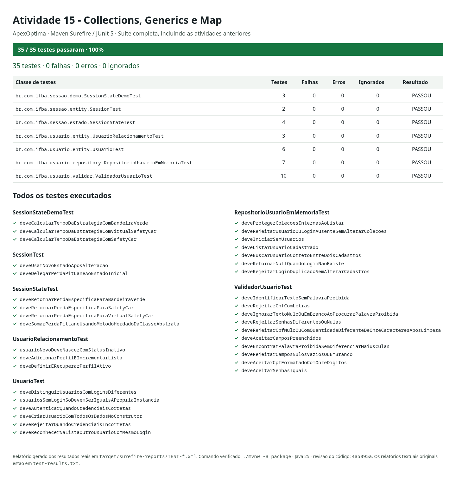

# Atividade 15 - Collections

O print mostra a barra verde e todos os 35 testes, incluindo os das atividades anteriores. É uma captura no navegador do [relatório da suíte](testsuite.html), gerado a partir dos resultados reais do Maven Surefire em `target/surefire-reports/TEST-*.xml`. Os [relatórios textuais originais](test-results.txt) também estão disponíveis.

Verificação: `./mvnw -B package` compilou o projeto, executou a suíte completa e gerou o JAR com sucesso usando Java 25. Para repetir localmente, execute `./mvnw clean test`.

A verificação da interface Swing também confirmou cadastro com sucesso, rejeição de login duplicado sem substituir o usuário original e preservação da mesma instância do repositório ao navegar cadastro → login → cadastro e cadastrar um segundo usuário.
